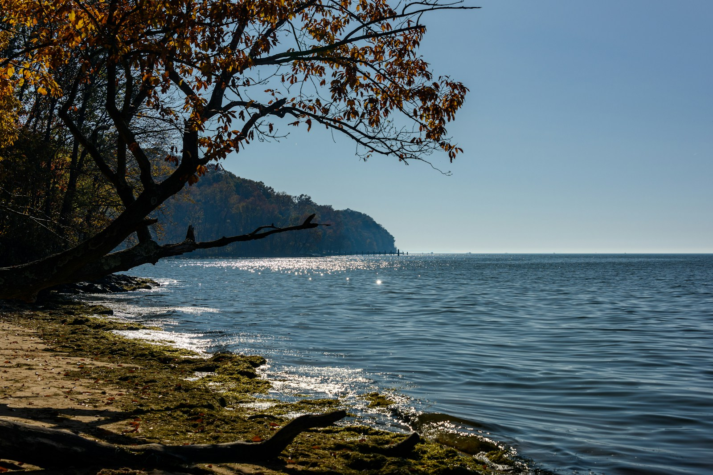
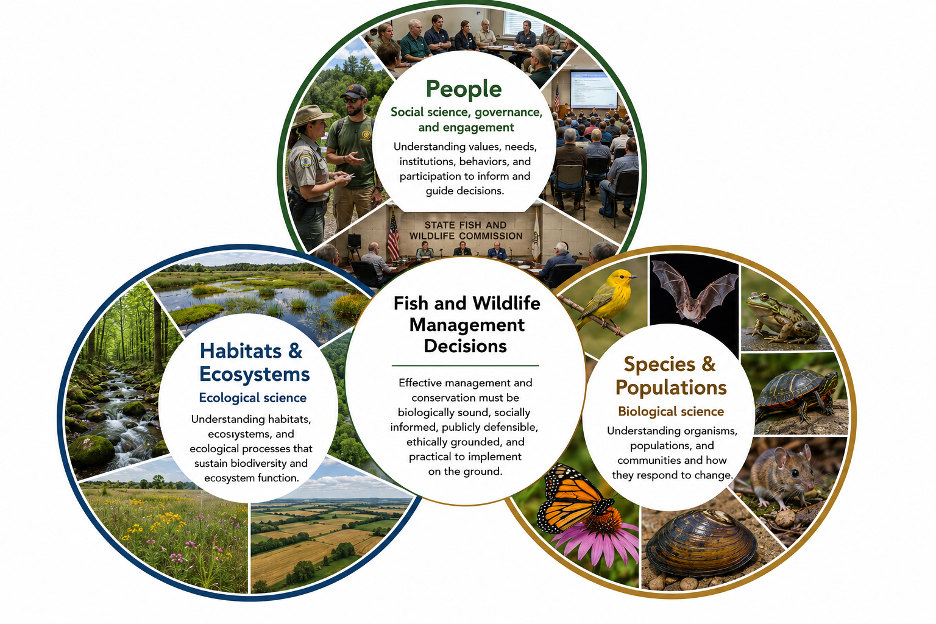
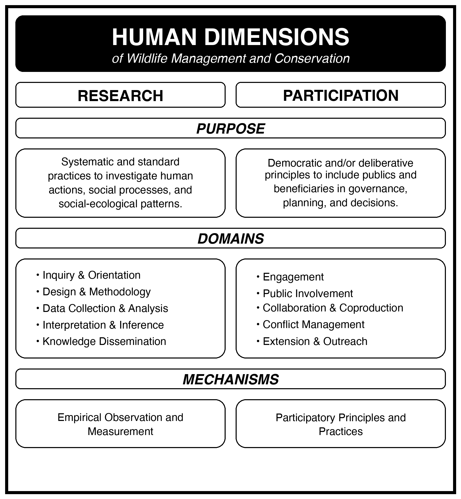
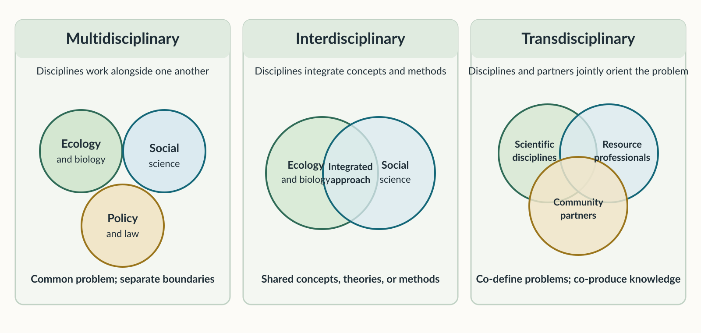
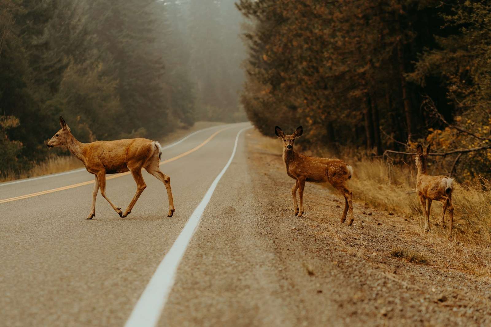

## Today's question

When biological evidence is sound, what still has to be worked out before a fish or wildlife decision can succeed?

::: {.source-note}
Source: Chapter 1, guiding questions; §§1.2–1.5.
:::

::: notes
Time: 2 minutes. Frame this as the chapter's central question, not as an argument against biological science. Invite one or two initial responses without resolving them yet.
:::

## What you should be able to do

By the end of today, you should be able to:

- explain why management is value-laden;
- use human dimensions as a problem orientation, not merely a set of public-opinion tools;
- distinguish research, participation, and transdisciplinary collaboration; and
- identify the human work embedded in a conservation decision.

::: {.source-note}
Source: Chapter 1, guiding questions and §§1.2–1.5.
:::

::: notes
Time: 1 minute. These objectives follow the chapter's guiding questions. Tell students that Friday's practice will use the Chesapeake Bay example from this chapter.
:::

## Chesapeake Bay is a shared social–ecological system

::: {.columns}

::: {.column width="53%"}

::: {.smaller}

The Bay is degraded by overfishing, pollution, nutrient loading, and habitat destruction.

- Runoff from agricultural and urban areas contributes to seasonal low-oxygen “dead zones.”
- Underwater grass beds and oyster reefs have declined, reducing nursery habitat for fishery species.
- Restoration decisions affect fisheries, livelihoods, recreation, and a place with deep cultural and Indigenous significance.

:::

:::

::: {.column width="47%"}

{.fill-content fig-alt="Autumn trees frame a shoreline on Chesapeake Bay. Sunlight reflects off the water, with a wooded point and distant small boats visible." height=430}

:::

:::

::: {.source-note}
Instructional content: Chapter 1, §1.2. Illustrative image: [Steve Adams / Unsplash](https://unsplash.com/photos/brown-tree-near-body-of-water-during-daytime-ckzTyM9SbMs).
:::

::: notes
Time: 2 minutes. Establish the Bay as the chapter's recurring example. The point is not to memorize its facts; it is to see a management problem as an ecological system and a working landscape.
:::

## The same Bay contains different stakes

Different publics may agree that the Bay matters while disagreeing about the problem, its causes, and acceptable solutions.

- Commercial fishers may focus on livelihood effects.
- Recreational anglers may emphasize fish abundance, clean water, and access.
- Farmers and landowners may face new runoff or conservation expectations.
- Environmental organizations may seek stricter standards.

::: {.source-note}
Source: Chapter 1, §1.2.
:::

::: notes
Time: 2 minutes. Ask: “Does naming all of these interests decide what to do?” No. It makes the management problem more accurately visible. Avoid turning these groups into caricatures.
:::

## Diagnosing the Bay is not the same as deciding what to do

::: {.bridge-slide}

Ecological science identifies the Bay’s condition and the likely effects of actions. It does not choose the action.

::: {.columns}

::: {.column width="48%"}

**Science can clarify**

- nutrient inputs, water quality, and habitat condition;
- likely effects of management actions.

:::

::: {.column width="52%"}

**A decision must still address**

- priority outcomes;
- acceptable tradeoffs; and
- affected publics and costs.

:::

:::

::: {.key-idea}
Ecological evidence identifies choices; values shape which choice is pursued.
:::

:::

::: {.source-note}
Source: Chapter 1, §§1.2–1.2.1.
:::

::: notes
Time: 2 minutes. Use the two columns as the handoff. First, ecological evidence identifies the condition and likely effects of options. Then ask: “Once we know that, what tells us which option to pursue?” The next slide names the answer: values shape the outcomes and actions people support.
:::

## Management is an expression of human values and actions

Management and conservation are value-laden enterprises.

::: {.compact}

- A value is a belief that an action—or the end state it produces—is desirable.
- Values shape the outcomes people prefer for fish, wildlife, and habitats.
- Values also shape the actions and policies people support to reach those outcomes.
- Because values differ, management choices can create conflict and tradeoffs.

:::

::: {.source-note}
Source: Chapter 1, §1.2.1, “Human Values Are Fish and Wildlife Management.”
:::

::: notes
Time: 3 minutes. Use the chapter's sequence: What end state is preferred for a species—protection, conservation, or hunting—and which actions are thought to lead there? Do not collapse the chapter's distinctions among instrumental/intrinsic, anthropocentric/biological, or utilitarian/mutualistic values; flag them as later vocabulary.
:::

## Decisions are nested within people, habitats, and species

{.fill-content fig-alt="Three overlapping circles surround a center labeled Fish and Wildlife Management Decisions. The circles are People, Habitats and Ecosystems, and Species and Populations. Each circle shows representative photos and describes its respective social-science, ecological-science, or biological-science foundations." height=600}

::: {.source-note}
Source: Chapter 1, Figure 1.1 and §1.2.1.
:::

::: notes
Time: 3 minutes. The published chapter caption calls this the three-legged-stool model; use the figure as a visible synthesis. Habitats and species draw heavily on biological and ecological sciences; the people dimension draws on social science, governance, and engagement. A stable decision integrates all three.
:::

## People and Natural Resources Affect Each Other

Human dimensions concerns the **human actions, social processes, and social-ecological relationships** that shape management.

- People affect fish, wildlife, and habitats through development, agriculture, harvest, recreation, and extraction.
- Fish, wildlife, and habitats affect people through subsistence, livelihoods, meanings, places, and other benefits.
- Those relationships shape management decisions.

::: {.source-note}
Source: Chapter 1, §1.3.
:::

::: notes
Time: 2 minutes. Emphasize reciprocity. HD is not a late-stage communication task after a biological decision is made; it describes relationships that are already shaping the system and the decision.
:::

## Human dimensions broadens the questions we ask

For a **deer season structure**, biological analysis might ask:

- How will the population change?

- What harvest level is sustainable?

- Are population goals being met?

A **human dimensions orientation** also asks:

- How will hunters respond to the season structure?

- How might it affect satisfaction, crowding, access, safety, or local economies?

- Who is affected, and what values may be in conflict?

- What evidence and public participation are needed?

::: {.source-note}
Source: Chapter 1, §1.3.
:::

::: notes
Time: 3 minutes. This is the chapter's deer-season example. Explain that human and biological evidence together improve the chances of decisions that can be implemented and publicly supported; neither is a substitute for the other.
:::

## Two complementary ways of working

{.fill-content fig-alt="A two-column framework for human dimensions. Research uses systematic and standard practices to investigate human actions, social processes, and social-ecological patterns. Participation uses democratic or deliberative principles to include publics and beneficiaries in governance, planning, and decisions." height=600}

::: {.source-note}
Source: Chapter 1, Figure 1.2 and §1.3.
:::

::: notes
Time: 3 minutes. Keep the two columns distinct. Research investigates; participation includes publics and beneficiaries in governance, planning, and decisions. Professional judgment and lived experience remain part of the broader HD practice described in the text.
:::

## Research asks systematic questions about people

- The social sciences provide principles, theories, methods, standards, and criteria for rigor.


- They help professionals describe and explain human values, attitudes, behaviors, institutions, causes, and outcomes—and critically examine assumptions and biases.

<br>
<br>

::: {.key-idea}
“Social science” is not one expertise. Psychology, sociology, anthropology, economics, law, policy science, political ecology, and environmental humanities bring different tools.
:::

::: {.source-note}
Source: Chapter 1, §1.3.1 and Table 1.1.
:::

::: notes
Time: 2 minutes. Use the chapter's analogy: an entomologist and mammalogist are not interchangeable, nor are a sociologist and political scientist. This is why transdisciplinary work needs specific expertise rather than a generic “social science” box.
:::

## Participation has two related forms

<br>
<br>

```{r}
#| echo: false
#| output: asis

data.frame(
  `Public involvement` = c(
    "Formal and legally required within a planning or decision process",
    "Includes notice, opportunity to participate, and a record of decision",
    "Example: notice-and-comment rulemaking"
  ),
  Engagement = c(
    "Continual interaction and dialogue with publics",
    "Emphasizes shared learning, relationship-building, and trust",
    "Example: an advisory group, community event, extension, or outreach"
  ),
  check.names = FALSE
) |>
  gt::gt() |>
  gt::cols_width(gt::everything() ~ gt::pct(50)) |>
  gt::tab_options(
    table.width = gt::pct(100),
    table.font.names = c("Lato", "sans-serif"),
    table.font.size = gt::px(24),
    column_labels.font.size = gt::px(26),
    column_labels.font.weight = "bold",
    column_labels.background.color = "#e0ebe0",
    column_labels.border.top.style = "solid",
    column_labels.border.top.color = "#2f6b57",
    column_labels.border.top.width = gt::px(4),
    data_row.padding = gt::px(12),
    table_body.hlines.style = "solid",
    table_body.hlines.color = "#c1d2c5",
    table_body.vlines.style = "none",
    table.border.top.style = "none",
    table.border.bottom.style = "none",
    table.border.left.style = "none",
    table.border.right.style = "none"
  )
```

::: {.source-note}
Source: Chapter 1, §1.3.2.
:::

::: notes
Time: 3 minutes. This is an important nuance. Do not imply that engagement is legally optional and therefore unimportant; the chapter presents it as a sustained practice that can make management more effective and trustworthy.
:::

## Collaboration is more than assembling experts

Transdisciplinary work goes beyond assembling academic expertise: it includes non-academic partners in defining the problem and producing useful knowledge.

<br>

{fig-alt="Three panels compare collaboration approaches. Multidisciplinary work shows ecology and biology, social science, and policy and law as separate circles working alongside one another. Interdisciplinary work shows ecology and biology overlapping with social science to form an integrated approach. Transdisciplinary work shows scientific disciplines, resource professionals, and community partners overlapping; together they co-define problems and co-produce knowledge." height=355}

::: {.source-note}
Source: Chapter 1, §1.3.3.
:::

::: notes
Time: 2 minutes. Read the diagram left to right. The key distinction is that transdisciplinary work does not merely integrate academic fields; non-academic partners jointly orient the problem and produce knowledge. Connect this to questions such as predator management, anadromous fish conservation, Tribal sovereignty and treaty rights, and access disputes, where the chapter says participation, deliberation, trust, lived experience, and Indigenous knowledge may all matter.
:::


## Collaboration requires understanding different perspectives

Working with publics means recognizing that people may understand the same problem very differently.

Their perspectives are shaped by:

- **values, beliefs, and attitudes**
- **norms and direct experiences**
- **risk perceptions and satisfaction**
- **political, historical, and cultural context**

Human dimensions helps make these differences visible and asks:

> **Will different publics experience the decision as fair, legitimate, and acceptable?**

::: {.source-note}
Source: Chapter 1, §1.4.1.
:::

::: notes
Time: 2 minutes. Explain that systematic research, principled participation, and multiple knowledge systems help professionals align ecological goals with social realities. This is not a promise that all publics will agree.
:::

## Different perspectives can create conflict—and exclusion

::: {.columns}

::: {.column width="57%"}

::: {.compact}

Human–wildlife interactions are rarely solved by **technical fixes alone**.

Lasting responses may require:

- **dialogue** among people with different interests and values;
- **trust** in agencies, processes, and other participants; and
- **meaningful participation** by affected publics.


:::

:::

::: {.column width="43%"}

{.fill-content fig-alt="Three deer stand at the edge of a paved two-lane road in a wooded landscape; one deer is crossing the road." height=350}

:::

Human dimensions also asks:

> **Who gets to participate—and who bears the costs of conservation decisions?**

:::
::: {.source-note}
Instructional content: Chapter 1, §§1.4.2–1.4.3. Illustrative image: [Emmanuel Munoz / Unsplash](https://unsplash.com/photos/deer-crossing-a-road-in-a-forest-zRp7-vLJbYI).
:::

::: notes
Time: 2 minutes. Use chapter examples sparingly: elk and agricultural losses, mountain lions and livestock, urban raccoons and property damage. Then make explicit that the chapter identifies Indigenous peoples, racial and ethnic minorities, economically disadvantaged groups, and some rural populations as facing barriers to participation or disproportionate burdens. Indigenous leadership, traditional knowledge, community-led restoration, mentorship, and removing financial or logistical barriers can strengthen both justice and conservation relevance.
:::

## Management decisions happen in the real world

::: {.compact}

Natural resource professionals work within changing **social, political, economic, and environmental conditions**.

That means navigating:

- **politics and resources** — political influence, budgets, development, and competing uses;
- **trust and communication** — misinformation, public trust, and shared responsibility;
- **technology** — new opportunities for research and access, alongside ethical and equity concerns; and
- **large-scale change** — climate change and urbanization that require engagement, incentives, and collaboration.

::: 

> **Good science is necessary—but it does not determine what is feasible, acceptable, or durable.**

::: {.source-note}
Source: Chapter 1, §§1.4.4–1.4.7.
:::

::: notes
Time: 2 minutes. This is the chapter's final practice arc, not a miscellaneous list. Link economics to policy impacts and nonmarket values; policy analysis to power and institutional structures; digital engagement to both access and digital exclusion; and climate adaptation to implementation with governments, communities, and conservation organizations.
:::

## Practice: reframe Chesapeake Bay restoration

In groups, use only the Chapter 1 account of the Bay. Prepare a 60-second explanation that answers:

1. What is the ecological condition or management concern?
2. Whose values, actions, or responsibilities make this a human-dimensions problem?
3. What is one research need **and** one participation need before a durable decision?

::: {.source-note}
Source: Chapter 1, §§1.2–1.3.3.
:::

::: notes
Time: 7 minutes. Give groups 3 minutes to prepare, hear two 60-second responses, then use 2 minutes to compare their research and participation choices. This prepares students for Friday's first graded application.
:::

## Effective management has a wider standard

Effective management and conservation must be:

- biologically sound;
- socially informed;
- publicly defensible;
- ethically grounded; and
- practical to implement on the ground.

::: {.source-note}
Source: Chapter 1, §1.5.
:::

::: notes
Time: 2 minutes. Return to the opening question. Human dimensions is woven into daily work—from defining a problem to implementing a decision—not a separate final step.
:::

## From Wednesday to Friday

For Friday's graded Chesapeake Bay application:

- make people, habitats, and species visible;
- identify two affected publics and a tradeoff; and
- distinguish evidence needed from participation needed.

The Week 1 reading quiz is due Sunday, August 30, at 11:59 p.m., before Week 02 Monday class.

::: {.source-note}
Source: Chapter 1, §§1.2–1.3.3; Week 1 Canvas module.
:::

::: notes
Time: 1 minute. Connect the week's sequence to the Canvas page. Do not add case facts beyond Chapter 1.
:::

## Exit check

Complete both statements:

1. Biological evidence cannot by itself decide ______.
2. A human-dimensions problem orientation changes a decision by asking ______.

::: {.source-note}
Source: Chapter 1, §§1.2.1, 1.3, and 1.5.
:::

::: notes
Time: 1 minute. Use a written or verbal response. Listen for values/tradeoffs/affected publics/participation and the reciprocal connection among people, habitats, and species.
:::
