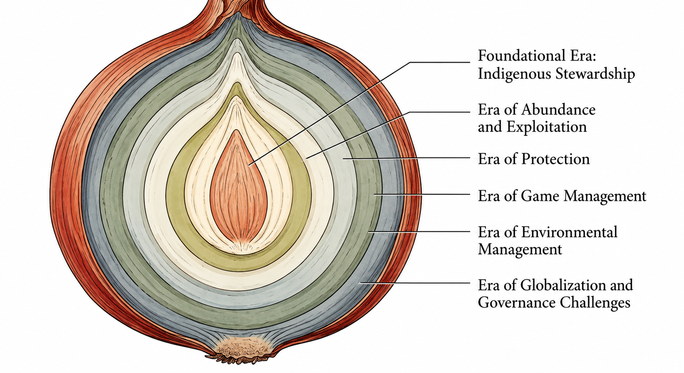

## Today's question

How do earlier eras of fish and wildlife management still shape a decision made
now?

 

::: {.fragment fragment-index=1}
History explains the **institutions, funding, laws, professional habits, and
public expectations** a manager inherits.
:::

::: {.source-note}
Source: Chapter 2, §§2.1--2.2.
:::

::: notes
Time: 2 minutes. Ask students to name one thing a current agency inherits. Hold
examples until the class has a shared vocabulary.
:::

## What you should be able to do

By the end of today, you should be able to:

- identify the defining priority and social context of each historical era;
- explain how an earlier era left a legacy for a current decision; and
- use a human-dimensions question to examine that legacy rather than treating it
  as neutral or inevitable.

::: {.source-note}
Source: Chapter 2, guiding questions; §2.2.
:::

::: notes
Time: 2 minutes. Preview that Wednesday begins with the public-trust question:
for whom should inherited institutions act?
:::

## History asks more than "what happened?"

 

::: {.columns}
::::: {.column width="33%"}
**Priority**

What problem seemed most urgent?
:::::
::::: {.column width="33%"}
**Context**

Which values, economics, and politics shaped the response?
:::::
::::: {.column width="33%"}
**Legacy**

What remains in current management?
:::::
:::

     

::: {.key-idea}
Conservation history traces changing relationships among people, species,
habitats, and institutions.
:::

::: {.source-note}
Source: Chapter 2, §§2.1--2.2.
:::

::: notes
Time: 3 minutes. Use these questions to prevent the class from becoming a list
of dates and names.
:::

## Conservation history is cumulative

{.fill-content fig-alt="An onion with nested layers representing six cumulative eras in North American fish and wildlife management: Indigenous stewardship; abundance; exploitation; protection; game management; environmental management; and globalization and international governance." height=520}

::: {.source-note}
Source: Chapter 2, Figure 2.1 and §§2.2.1--2.2.8.
:::

::: notes
Time: 3 minutes. Each layer arose in response to new challenges, but did not
erase earlier assumptions or institutions. The figure does not imply equal power
across eras.
:::

## A timeline tells order; history explains inheritance

 

::: {.columns}
::::: {.column width="48%"}
**Timeline question**

What came next?
:::::
::::: {.column width="52%"}
**Historical question**

What did this era leave behind for today's decisions?
:::::
:::

   

An inherited legacy might be a legal framework, a source of agency revenue, an
idea about expertise, or a pattern of inclusion and exclusion.

::: {.source-note}
Source: Chapter 2, §2.2.
:::

::: notes
Time: 2 minutes. Emphasize "left behind," not simple one-to-one causation.
:::

## Indigenous stewardship is the first layer {.section-slide background-color="#123f5a"}

The history of North American fish and wildlife management begins long before
European colonization.

::: notes
Time: 1 minute. This is a substantive foundation, not a preface to a settler
conservation story.
:::

## Indigenous stewardship: reciprocal responsibility

Many Indigenous nations developed place-based stewardship systems over
millennia.

- Humans are part of relationships with living and nonliving beings.
- Stewardship can be guided by respect, relevance, responsibility, and
  reciprocity.
- Knowledge is created and shared across generations through oral and visual
  traditions.

::: {.source-note}
Source: Chapter 2, §2.2.1.
:::

::: notes
Time: 3 minutes. Indigenous nations are not monolithic. Contrast this relational
framing with the utilitarian resource-or-commodity paradigm later common in
Western law and agencies, without treating either tradition as uniform.
:::

## "Pristine wilderness" is an incomplete history

Framing conservation history as beginning with Muir or Roosevelt overlooks the
active management of pre-colonial landscapes.

::: {.fragment fragment-index=1}
Landscapes were actively shaped by Indigenous peoples: Karuk and Yurok
controlled fire; Lakota and Blackfeet developed bison-harvest practices; Lummi
and Yakama created salmon fisheries.
:::

::: {.fragment fragment-index=2}
Ignoring that stewardship erases Indigenous cultures and can help justify
removal from ancestral lands.
:::

::: {.source-note}
Source: Chapter 2, §2.2.1.
:::

::: notes
Time: 3 minutes. Recognizing this history is both an accuracy and an ethical
question.
:::

## The legacy continues through governance

Contemporary collaboration and co-management include:

- Mille Lacs Lake fishery management and treaty-rights partners;
- Menominee forest management and a seventh-generation responsibility;
- Indigenous input to the Alexander Archipelago wolf assessment; and
- Hawaiian marine governance that integrates customary values.

::: {.source-note}
Source: Chapter 2, §2.2.1.
:::

::: notes
Time: 3 minutes. These are not interchangeable models or automatically
successful outcomes. The wolf assessment also shows limits in fully
incorporating Indigenous knowledge.
:::

## Abundance became a utilitarian premise {.section-slide background-color="#123f5a"}

1600--1850: European settlers commonly perceived North American resources as
effectively endless.

::: notes
Time: 1 minute. Move to the social and economic premises that made intensive
extraction seem reasonable to many settlers.
:::

## Era of Abundance: freedom, opportunity, and commodities

European restrictions on hunting had often served monarchs and aristocrats. In
North America, fewer restrictions helped make wildlife seem like:

- a freely usable resource;
- a symbol of freedom and opportunity; and
- a source of profit in market hunting, trapping, and the fur trade.

::: {.key-idea}
Perceived abundance helped normalize a belief that use did not require long-term
restraint.
:::

::: {.source-note}
Source: Chapter 2, §2.2.2.
:::

::: notes
Time: 3 minutes. This was a cultural, economic, and political mindset, not
merely an error about animal numbers. Use beaver and the global fur trade as the
example.
:::

## Exploitation made the limits visible {.section-slide background-color="#123f5a"}

1850--1900: industrial-scale commerce in "fin, feather, and fur" outpaced weak
conservation institutions.

::: notes
Time: 1 minute. Ask students to listen for a convergence of forces, not a single
cause.
:::

## Era of Exploitation: short-term use, lasting damage

::: {.columns}
::::: {.column width="50%"}
**Conditions**

- few regulatory frameworks;
- industrial-scale markets;
- new harvest technologies; and
- westward expansion.
:::::
::::: {.column width="50%"}
**Consequences**

- depleted deer and beaver;
- reduced predator ranges;
- declining salmon; and
- near extermination of bison.
:::::
:::

::: {.source-note}
Source: Chapter 2, §2.2.3 and Figure 2.2.
:::

::: notes
Time: 3 minutes. Connect conditions to outcomes. The American Fisheries Society
was founded in 1870 during this era.
:::

## Bison shows why a social history matters

The near extermination of bison reflected a convergence of:

- industrial hide harvest and market demand;
- military and government campaigns against Indigenous peoples; and
- westward expansion.

::: {.key-idea}
Ecological decline is often inseparable from political power, economic systems,
and human relationships.
:::

::: {.source-note}
Source: Chapter 2, §2.2.3.
:::

::: notes
Time: 3 minutes. This is why a purely biological account is incomplete. Keep the
claim precise: several forces converged; harvest alone does not explain the outcome.
:::

## Protection changed the rules {.section-slide background-color="#123f5a"}

1900--1930: overharvest and species decline produced organized advocacy, new
laws, and new conservation institutions.

::: notes
Time: 1 minute. Protection was a response to failure, not a clean break with all
earlier social patterns.
:::

## Era of Protection: from commodity to public concern

The passenger pigeon and Carolina parakeet were extinct; bison had fallen to
roughly a thousand animals by the 1890s.

- Harriet Hemenway and Minna Hall organized opposition to the plume trade and
  helped establish the Massachusetts Audubon Society.
- The Lacey Act (1900) restricted interstate commerce in illegally taken
  wildlife.

::: {.source-note}
Source: Chapter 2, §2.2.4 and Figure 2.3.
:::

::: notes
Time: 3 minutes. The plume trade illustrates grassroots advocacy joining
government action. Do not reduce the movement to famous figures alone.
:::

## Protection required cooperation beyond one state

The Migratory Bird Treaty Act (1918):

- followed a U.S.--Great Britain treaty acting on Canada's behalf;
- made most migratory birds illegal to hunt, capture, or sell; and
- recognized that migratory species require management at a continental scale.

::: {.source-note}
Source: Chapter 2, §2.2.4.
:::

::: notes
Time: 2 minutes. The instructional point is scale: species cross boundaries that
state-by-state rules cannot fully address.
:::

## Game management built a profession {.section-slide background-color="#123f5a"}

1930--1960: management moved from reactive protection toward proactive,
science-based restoration and sustainable use.

::: notes
Time: 1 minute. Ask what changes when a profession is built around scientific
expertise and a dependable revenue source.
:::

## Era of Game Management: a durable funding legacy

::: {.smaller}
  | Program                      | Revenue source                             | What it supported                                                   |
  | ---------------------------- | ------------------------------------------ | ------------------------------------------------------------------- |
  | Pittman–Robertson Act (1937) | Excise tax on sporting arms and ammunition | State wildlife restoration, habitat, research, public hunting areas |
  | Dingell–Johnson Act (1950)   | Excise tax on certain fishing tackle       | Sport-fish restoration and related state projects                   |
:::

::: {.key-idea}
The model linked purchases by hunters, anglers, and later boaters to public
conservation benefits.
:::

::: {.source-note}
Source: Chapter 2, §2.2.5.
:::

::: notes
Time: 3 minutes. Name the "user-pays, public-benefits" model. Wallop-Breaux
later broadened the sport-fish revenue base. Ask how a funding
model might shape agency priorities and public expectations.
:::

## Expertise, education, and organizations expanded

Professionalization created a durable infrastructure:

- Leopold's *American Game Policy* (1930) and *Game Management* (1933);
- a Wisconsin wildlife degree program and Cooperative Wildlife Research Units;
- The Wildlife Society and Ducks Unlimited (both 1937); and
- a land ethic that framed conservation as a moral duty of care.

::: {.source-note}
Source: Chapter 2, §2.2.5.
:::

::: notes
Time: 2 minutes. These established scientific principles, credentials, and
organizations that still shape practice. Leopold's land ethic also connects to
relational ideas of kinship and reciprocity.
:::

## A successful model can still be narrow

The game-management era elevated game and sportfish, but it also created costs:

- nongame species and broader ecological problems received less priority;
- public outreach often remained one-way education; and
- programs could displace Indigenous communities, overlook knowledge, and
  reproduce racial and economic exclusions.

::: {.source-note}
Source: Chapter 2, §2.2.5.
:::

::: notes
Time: 3 minutes. This is not a dismissal of restoration achievements. Any
framework sets priorities and distributes benefits.
:::

## Environmental management broadened the frame {.section-slide background-color="#123f5a"}

1960--1990: conservation increasingly addressed ecosystems, environmental harm,
public participation, and accountability.

::: notes
Time: 1 minute. The social context included environmental and civil-rights
movements, anti-war protest, and increasing distrust of institutions.
:::

## Era of Environmental Management: systems, not isolated species

Rachel Carson's *Silent Spring* (1962) helped connect pesticide use to
ecological and human-health consequences.

::: {.fragment fragment-index=1}
The management question widened: How do habitats, ecosystems, pollution, and
human systems interact?
:::

::: {.fragment fragment-index=2}
The social question widened too: Who participates, and how are institutions
accountable?
:::

::: {.source-note}
Source: Chapter 2, §2.2.6.
:::

::: notes
Time: 3 minutes. Contrast a priority on selected species and use with an
attention to interconnected ecological and human systems. Neither question has
disappeared from current practice.
:::

## Law made participation and accountability more visible

::: {.columns}
::::: {.column width="50%"}
**National Environmental Policy Act (1970)**

Institutionalized public participation and accountability in environmental
decision-making.
:::::
::::: {.column width="50%"}
**Endangered Species Act (1973)**

Made protection of imperiled species a national conservation priority.
:::::
:::

::: {.source-note}
Source: Chapter 2, §2.2.6.
:::

::: notes
Time: 2 minutes. Keep this out of the weeds of legal procedure. These laws show
that conservation is not only a technical question.
:::

## Human dimensions became a named professional field

Early information from hunters often served "surrogate biology": estimating
harvest and population measures.

::: {.fragment fragment-index=1}
The emerging field added different questions: landowner--hunter conflict,
recreation experiences, wildlife values, economic effects, and public
participation.
:::

::: {.fragment fragment-index=2}
In 1973, a North American Wildlife and Natural Resources Conference session
formally introduced "human dimensions in wildlife programs."
:::

::: {.source-note}
Source: Chapter 2, §2.2.6, Boxes 2.1--2.2.
:::

::: notes
Time: 3 minutes. Data collected from people are not automatically
human-dimensions research; the management question and purpose matter. Give
Missouri's early farmer/hunter studies and the 1955 National Survey as chapter
examples.
:::

## Institutionalization changed who agencies could learn from

::: {.smaller}
  | Development                                     | What it made more possible                  |
  | ----------------------------------------------- | ------------------------------------------- |
  | Missouri hired Dan Witter (1978)                | Full-time agency human-dimensions expertise |
  | Cornell's Human Dimensions Research Unit        | Dedicated university research capacity      |
  | Yale's Human Dimensions of Wildlife Study Group | Professional scholarly community            |
  | Later journals and university programs          | A recognized field and shared methods       |
:::

::: {.source-note}
Source: Chapter 2, §2.2.6, Boxes 2.1--2.2.
:::

::: notes
Time: 2 minutes. Agency leadership and university research both mattered. The "N
of 1" capacity challenge returns in modern challenges.
:::

## Globalization and international governance change the scale {.section-slide background-color="#123f5a"}

1990--present: conservation problems and solutions increasingly cross
ecological, political, and social boundaries.

::: notes
Time: 1 minute. This is another layer, not a replacement for local or state
management.
:::

## Global challenges require connected governance

Contemporary conservation faces interconnected challenges:

- biodiversity loss and landscape fragmentation;
- wildlife trade and invasive species;
- climate change and shifting species distributions; and
- urbanization and changing relationships with wildlife.

::: {.key-idea}
When a problem crosses boundaries, management needs cooperation among
institutions, communities, and publics at multiple scales.
:::

::: {.source-note}
Source: Chapter 2, §2.2.7.
:::

::: notes
Time: 2 minutes. Give the North American Waterfowl Management Plan as a
cross-border partnership example.
:::

## International frameworks meet local knowledge

Global agreements and local governance operate together:

- CBD and CITES help align national and local work with global priorities.
- The European Union's Common Fisheries Policy uses public engagement and
  adaptive management.
- Namibia's community conservancies connect local knowledge, livelihoods,
  wildlife coexistence, and conservation goals.

::: {.source-note}
Source: Chapter 2, §2.2.7.
:::

::: notes
Time: 3 minutes. Treat the examples as illustrations, not blueprints. In
Namibia, tourism and regulated-hunting income can be reinvested
in local projects, potentially reducing conflict and supporting conservation.
:::

## Modern challenges reveal the accumulated layers {.section-slide background-color="#2f6b57"}

The history becomes useful when it helps diagnose a present conservation
problem.

::: notes
Time: 1 minute. Shift from historical description to application.
:::

## A present decision is social, ecological, and institutional

For urban wildlife, predator reintroduction, habitat restoration, or climate
adaptation, a manager may need to ask:

- Which publics experience benefits, costs, or risk?
- Which authorities and knowledge systems have a role?
- What history shapes funding, trust, access, or participation?
- What new challenges make older approaches insufficient?

::: {.source-note}
Source: Chapter 2, §2.2.8.
:::

::: notes
Time: 3 minutes. Ground these in wildlife conflict, rural/urban
tension, Tribal/state/federal authority, technology, justice, capacity,
nonconsumptive use, and changing societal values.
:::

## Technology adds capacity---and new questions

::: {.columns}
::::: {.column width="50%"}
**New possibilities**

GIS, remote sensing, data science, iNaturalist, eBird, and social media can
expand research and participation.
:::::
::::: {.column width="50%"}
**New responsibilities**

Managers must consider access, data quality, privacy, misinformation, and who
benefits from technology.
:::::
:::

::: {.source-note}
Source: Chapter 2, §2.2.8.
:::

::: notes
Time: 2 minutes. Technology is not only a tool; it changes relationships,
authority, participation, and distribution of benefits.
:::

## Practice: trace one legacy forward

With a partner, choose one Chapter 2 era. Prepare a 45-second explanation:

1. What priority, institution, or assumption is associated with that era?
2. How could it still shape a current fish or wildlife decision?
3. What human-dimensions question would a manager ask before treating that
   legacy as neutral or inevitable?

::: {.source-note}
Source: Chapter 2, §2.2.
:::

::: notes
Time: 7 minutes. Give pairs 3 minutes to prepare, then hear three explanations
and compare them. Prompt for specificity: "funding from excise taxes" is
stronger than "the past matters."
:::

## From history to public responsibility

::: {.fragment fragment-index=1}
History shows that management inherits layered priorities and institutions.
:::

::: {.fragment fragment-index=2}
Wednesday asks the next question:

> **For whom should those institutions act, and how are they accountable?**
:::

::: {.source-note}
Source: Chapter 2, §§2.2--2.3; Chapter 3, §§3.1--3.3.
:::

::: notes
Time: 2 minutes. Connect to public trust thinking: beneficiaries, trustees,
trust managers, and future generations.
:::

## Exit check

Complete both statements:

1. One current management decision is shaped by the legacy of \_\_\_\_\_\_
   because \_\_\_\_\_\_.
2. A human-dimensions question about that legacy would ask \_\_\_\_\_\_.

::: {.source-note}
Source: Chapter 2, §§2.2--2.3.
:::

::: notes
Time: 3 minutes. Look for an era-specific claim and an actual management
connection: values, publics, institutions, participation, funding, authority,
access, or distribution of benefits and burdens.
:::
