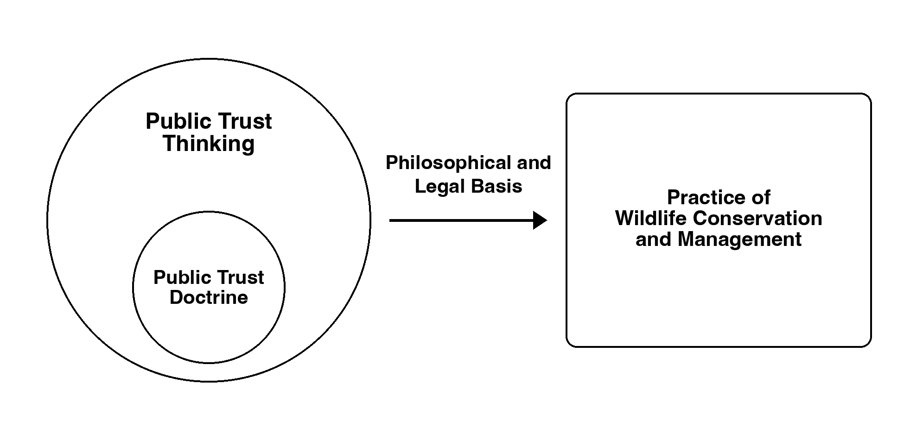

## Today's question

What does it mean to manage fish and wildlife as a public trust?

::: {.source-note}
Source: Chapter 3, §3.1--3.2.
:::

::: notes
Time: 2 minutes. Retrieve the Week 2 Monday question: How does history shape
present management?
:::

## What you should be able to do

By the end of today, you should be able to:

- distinguish public trust thinking from the public trust doctrine;
- identify assets, beneficiaries, trustees, and trust managers in a management
  problem; and
- connect one historical legacy to a public-trust responsibility in a current
  decision.

::: {.source-note}
Source: Chapter 3, §§3.1--3.4.
:::

::: notes
Time: 1 minute. Preview that the Friday case asks students to use these terms,
not only recognize them.
:::

## A public responsibility {.section-slide background-color="#123f5a"}

Fish and wildlife management asks not only what works, but for whom it must
work.

::: notes
Time: 30 seconds. Use this as a bridge from Monday's historical inheritance to
Chapter 3's present responsibility.
:::

## The public-trust starting point

Free-ranging fish and wildlife are generally treated as public resources rather
than objects of private ownership.

   

::: {.key-idea}
Public trust thinking asks managers to steward these resources for current and
future publics.
:::

::: {.source-note}
Source: Chapter 3, §3.2.
:::

::: notes
Time: 3 minutes. Explain that this is a philosophical and practical framework,
not merely a slogan.
:::

## An endowment, not a private commodity

Public trust thinking begins from three linked claims:

- fish and wildlife are an endowment held across generations;
- their benefits deserve fair consideration for all citizens; and
- government has a stewardship responsibility that cannot be reduced to serving
  one present-day user group.

::: {.source-note}
Source: Chapter 3, §§3.2--3.3 and Table 3.1.
:::

::: notes
Time: 2 minutes. Connect this to Monday: the legal and institutional layers of
conservation are inherited, but public trust thinking asks what present
responsibility they create. Do not equate fair consideration with identical
outcomes for every public.
:::

## Public trust is the responsibility; thinking is how we use it

**Public trust** is the public relationship: governments hold a responsibility
to care for shared fish and wildlife resources on behalf of the public.

 

**Public-trust thinking** is the decision frame: use that responsibility to ask
what is being held in trust, who is affected, who has authority, what future
options matter, and how decision-makers will be accountable.

 

::: {.key-idea}
Public trust names the relationship. Public-trust thinking turns that
relationship into questions for a real decision.
:::

::: {.source-note}
Source: Chapter 3, §§3.1--3.3.
:::

::: notes
Time: 4 minutes. Say this distinction explicitly before introducing the
vocabulary. A student should be able to finish this sentence: "Public trust is
the responsibility; public-trust thinking is the way we reason from it in a
particular case." The doctrine comes later as one legal expression, not as a
synonym for either term.
:::

## Core public-trust questions

- What are the trust assets?
- Who are the beneficiaries?
- Who acts as trustee, trust manager, or trust administrator?
- How are current and future generations considered?
- How can beneficiaries hold administrators accountable?

::: {.source-note}
Source: Chapter 3, §3.1--3.3.
:::

::: notes
Time: 2 minutes. Use these terms precisely. Students will use them Friday.
:::

## A trust has connected roles

**Assets:** Fish and wildlife within a government's jurisdiction.

**Beneficiaries:** Current and future publics with legitimate interests in how
those assets are managed.

**Trustees:** Public officials with authority to make or direct public
decisions.

**Trust managers:** Professional staff who develop options, implement decisions,
communicate, and learn from results.

 

::: {.key-idea}
The public-trust question is relational: who is responsible to whom, for what,
and across what time horizon?
:::

::: {.source-note}
Source: Chapter 3, §§3.3.1--3.3.3.
:::

::: notes
Time: 4 minutes. This intentionally uses a single vertical reading path rather
than a three-column layout: students should first identify what is held in
trust, then who benefits, then who decides and implements. Clarify that
beneficiaries are broader than the loudest or most direct users.
:::

## Trustees and trust managers do different work

::: {.columns}
::::: {.column width="50%"}
**Trustees**

Public officials who set direction, make decisions, and are accountable to
beneficiaries.
:::::
::::: {.column width="50%"}
**Trust managers**

Professional staff who develop options, implement decisions, communicate, and
learn from results.
:::::
:::

 

::: {.key-idea}
Authority and expertise are connected, but they are not interchangeable.
:::

::: {.source-note}
Source: Chapter 3, §3.3.3.
:::

::: notes
Time: 2 minutes. Ask students which role they would expect to set a harvest
regulation and which role would collect evidence or communicate implementation.
A manager can advise and implement without possessing the same legal authority
as a trustee.
:::

## Intergenerational equity

Present generations have responsibilities to steward resources so that current
choices do not foreclose important future options.

::: {.source-note}
Source: Chapter 3, §3.2.
:::

::: notes
Time: 2 minutes. Ask students what makes this more demanding than simply serving
current users. Do not introduce extra examples.
:::

## Intergenerational equity changes the time horizon

::: {.columns}
::::: {.column width="48%"}
**A narrow present-only question**

Who gains or loses from this decision now?
:::::
::::: {.column width="52%"}
**A public-trust question**

What options, resources, and responsibilities will this decision leave for
future beneficiaries?
:::::
:::

::: {.source-note}
Source: Chapter 3, §3.2.
:::

::: notes
Time: 2 minutes. This is not a promise that every future outcome can be
predicted. It is a duty to make the time horizon visible rather than treating it
as irrelevant.
:::

## Accountability is part of stewardship

::: {.fragment fragment-index=1}
Trust administrators need to explain what information they considered, how
public input was used, and why a decision was made.
:::

::: {.fragment fragment-index=2}
Transparency does not guarantee agreement.
:::

::: {.fragment fragment-index=3}
It gives beneficiaries a basis to understand and evaluate whether administrators
are serving the public interest.
:::

::: {.source-note}
Source: Chapter 3, §3.4.
:::

::: notes
Time: 2 minutes. Distinguish accountability from unanimity. This is the bridge
from the framework to human-dimensions research and participation.
:::

## Public trust thinking and doctrine

{fig-alt="A large circle labeled Public Trust Thinking contains a smaller circle labeled Public Trust Doctrine. An arrow labeled Philosophical and Legal Basis points to a box labeled Practice of Wildlife Conservation and Management." height=440}

Public trust thinking guides law, policy, and practice; the doctrine is one
legal expression of that responsibility.

::: {.source-note}
Source: Chapter 3, §3.2--3.3.
:::

::: notes
Time: 2 minutes. Use the figure's alt text as the text equivalent. Ask students
to make the distinction in their own words before revealing the final sentence.
:::

## Doctrine is one tool within a broader responsibility

**Public trust** establishes the public responsibility for the resource.

**Public trust thinking** is the broader philosophical and practical orientation
that applies that responsibility to stewardship choices.

**Public trust doctrine** is a legal concept that can define or protect public
interests in particular settings.

 

::: {.key-idea}
Legal compliance matters, but it does not exhaust the question of whether a
decision serves current and future beneficiaries well.
:::

::: {.source-note}
Source: Chapter 3, §§3.3.4--3.4.
:::

::: notes
Time: 3 minutes. Contrast all three terms. Public trust is the relationship and
responsibility; public-trust thinking is the frame for analyzing a decision; the
doctrine is a legal tool that can protect public interests in particular
settings. Students should avoid saying every public-trust question has a single
doctrine-based answer.
:::

## From framework to case {.section-slide background-color="#2f6b57"}

The Montana stream-access conflict carries forward history's questions about
public concern, institutional authority, participation, and accountability.

 

On Friday, connect one Chapter 2 legacy to this Chapter 3 public-trust decision.

::: notes
Time: 30 seconds. Make the bridge explicit: Monday showed that law, public
institutions, participation, and accountability are historical inheritances.
Friday asks students to show how one of those inheritances makes the Montana
access conflict a public-responsibility question. The case does not ask them to
settle a general property-law debate.
:::

## Friday application: Montana stream access

 

**The question your group will answer:** How did Montana protect public
recreational use of water while recognizing limits on use of adjacent private
property?

 

Use Monday's Chapter 2 history material and Chapter 3 to explain:

1. one historical legacy that makes this a public-responsibility question;
2. the conflict and who resolved it;
3. why navigability for **title** differs from navigability for **use**;
4. who benefits, what access is limited, and what tradeoff remains; and
5. what accountable implementation still requires.

::: {.source-note}
Source: Chapter 2, §§2.2.6, 2.2.8; Chapter 3, §3.5.1.
:::

::: notes
Time: 3 minutes. This is the assignment in plain language. The history link is
not a request for a timeline: students choose one legacy from Monday--public
concern, institutional authority, participation, or accountability--and explain
how it frames the present access conflict. Name the Dearborn and Beaverhead
conflicts, *Curran* and *Hildreth*, and the Montana Stream Access Law only as
the case evidence students will use. Students should revisit Monday's notes and
reread §3.5.1 before Friday; do not use outside facts.
:::

## What Friday will look like

1. **0--5 minutes --- Start alone:** Identify the public-use question; use your
   optional preparation note if you made one.
2. **5--8 minutes --- Form your group:** Record names and your preassigned
   roles.
3. **8--30 minutes --- Build the explanation:** Use Monday's history material
   and §3.5.1 to complete all four response sections.
4. **30--34 minutes --- Submit:** One present member submits the shared Canvas
   response.
5. **34--44 minutes --- Defend the reasoning:** Be ready to explain the analysis
   connected to your role.
6. **44--50 minutes --- Individual check and close:** Complete the private
   Friday Group Check, then synthesize the case.

::: notes
Time: 3 minutes. Walk through the sequence so students know what happens, what
they produce, and what each person must do. The class activity is not a debate
with a hidden answer; it is a structured, evidence-based explanation of the
chapter case.
:::

## What your group will submit

Submit one shared Canvas response with the names and roles of everyone present.
Use four short, evidence-based sections:

1. **Historical legacy, access question, and authority:** Connect one Chapter 2
   legacy to the conflict, court decisions, and subsequent law.
2. **Concept and evidence:** Distinguish navigability for title from use;
   connect that distinction to one case detail.
3. **Beneficiaries, boundary, and tradeoff:** Name specific beneficiaries, the
   private-bank limit, and what the rule protects and constrains.
4. **Accountability and next step:** Explain a remaining implementation,
   communication, or accountability need.

Aim for 2--3 complete sentences per section, not an essay. The shared response
is 80% of the score; the individual Group Check is 20%.

::: notes
Time: 3 minutes. Put the actual deliverable on the screen. Stress that the group
is explaining the chapter case, not inventing a new fact pattern or choosing a
personal side without evidence.
:::

## Optional before-Friday preparation: make a five-note case sheet

**Thursday night or before Friday class (about 10 minutes):** Revisit Monday's
history notes and reread Chapter 3, §3.5.1. Bring five brief notes:

1. one Chapter 2 historical legacy that frames the access conflict;
2. the public-use and private-property question;
3. navigability for **title** versus navigability for **use**;
4. beneficiaries and the boundary on private-bank use; and
5. one accountability or implementation question.

This is optional and is **not submitted or graded**. If you make it, bring it to
class; your group can use it to start the shared response.

::: {.source-note}
Source: Chapter 2, §§2.2.6, 2.2.8; Chapter 3, §3.5.1.
:::

::: notes
Time: 1 minute. This replaces the former in-class case-preparation pair work.
Tell students it is a short optional preparation note, not a required or graded
assignment. Friday begins with the public-use question for everyone; students
who made the note may use it to start their reasoning.
:::

## Close: what your Friday response must explain

Your group is **not** deciding whether you personally favor stream access.

Your group is explaining how Montana addressed this question:

> When water crosses or borders private property, what public recreational use
> is protected, and where is the limit?

A strong response connects the court decisions and Stream Access Law to:

- one historical legacy that frames this as a public-responsibility question;
- the difference between navigability for **title** and for **use**;
- the public beneficiaries of access;
- the limit on using private banks; and
- one remaining implementation or communication responsibility.

::: {.source-note}
Source: Chapter 2, §§2.2.6, 2.2.8; Chapter 3, §3.5.
:::

::: notes
Time: 1 minute. Read the block quote aloud. State plainly: "Friday is an
explanation of how the Montana case resolved this conflict, using one specific
historical legacy from Monday and the Chapter 3 case; it is not a vote on
whether you personally support access." Remind students to complete the
optional five-note case sheet before Friday if they want additional preparation.
Friday applies these concepts to the Montana case. The next reading quiz is due
Sunday at 11:59 p.m. before Monday's class.
:::
