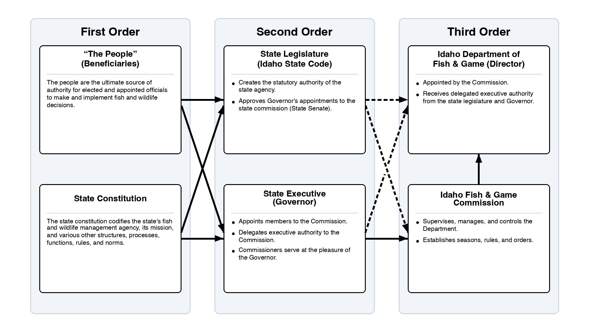
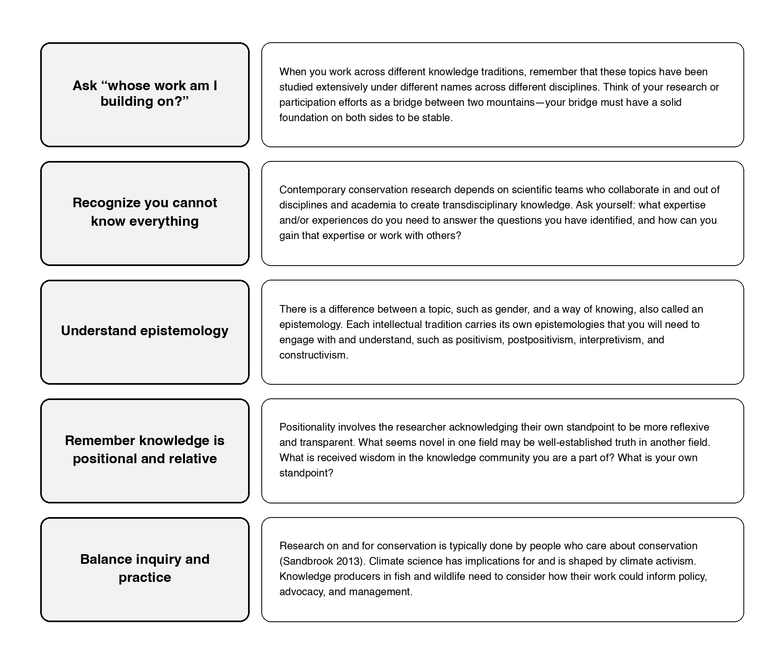

## This week begins Wednesday

Monday is Labor Day. Today integrates Chapters 4 and 5 to prepare for Friday's application.

::: notes
Time: 2 minutes. Confirm that the quiz is due Tuesday at 11:59 p.m., before Wednesday's class, because Monday is Labor Day.
:::

## Today's question

How do equity, inclusion, justice, and governance shape whether a conservation decision is legitimate and durable?

::: {.source-note}
Source: Chapter 4, §4.1–4.2; Chapter 5, §5.1–5.2.
:::

::: notes
Time: 3 minutes. Position the topics as integral to management practice.
:::

## What you should be able to do

By the end of today, you should be able to:

- identify how access, recognition, participation, and influence affect a decision;
- distinguish governance from a single agency's day-to-day action; and
- propose one accountable process that could strengthen the durability of a conservation decision.

::: {.source-note}
Source: Chapters 4–5, §§4.1–4.2 and §§5.1–5.3.
:::

::: notes
Time: 2 minutes. Explain that Friday asks students to make both a justice and a governance claim using the same case.
:::

## Justice is a management condition {background-color="#123f5a" .section-slide}

Access, influence, and recognition shape whether a conservation decision can be publicly legitimate.

::: notes
Time: 1 minute. Do not present DEIJ as separate from ecological outcomes or implementation.
:::

## DEIJ is part of management practice

Chapter 4 connects DEIJ to:

- access to land and water;
- whose knowledge is recognized;
- who bears costs and receives benefits; and
- who has influence in public processes.

::: {.source-note}
Source: Chapter 4, §4.2.
:::

::: notes
Time: 6 minutes. Do not reduce DEIJ to representation alone. Ask students what each bullet means in a decision context.
:::

## Four related terms

- **Diversity:** varying attributes within a community.
- **Equity:** fair opportunity to engage and benefit, including attention to barriers.
- **Inclusion:** being accepted, supported, and able to contribute.
- **Justice:** fair practices that dismantle barriers and enable full participation.

::: {.source-note}
Source: Chapter 4, Table 4.1.
:::

::: notes
Time: 7 minutes. This is a concise text equivalent for Table 4.1. Ask students to distinguish equity from equality using only the table's definitions.
:::

## A process can include people without sharing influence

::: {.columns}
::: {.column width="48%"}

**Presence only**

People are invited, but barriers limit their participation or their knowledge has no effect on the decision.

:::
::: {.column width="52%"}

**Meaningful inclusion**

Relevant publics can participate, their knowledge is recognized, and the process makes clear how their input can affect the decision.

:::
:::

::: {.source-note}
Source: Chapter 4, §§4.2–4.3.
:::

::: notes
Time: 4 minutes. Ask: “What would make an invitation insufficient?” Listen for access barriers, token participation, recognition, and a lack of meaningful influence. Do not require personal disclosure.
:::

## Governance makes process consequential {background-color="#2f6b57" .section-slide}

Rules, institutions, and power determine who can decide, implement, enforce, and participate.

::: notes
Time: 1 minute. Bridge from justice concerns to the mechanisms that can either reproduce or address them.
:::

## Governance turns commitments into action

Governance is the interplay of rules, policies, institutions, and powers that guide decision-making, implementation, and enforcement.

{fig-alt="A three-column example of state-level fish and wildlife governance in Idaho. Beneficiaries and the state constitution connect to the state legislature and governor, which connect to the department and fish and game commission. The figure illustrates how legal authority flows from beneficiaries to trust administrators." height=390}

The chapter's governance model asks students to identify:

- decision-making;
- implementation; and
- enforcement.

::: {.source-note}
Source: Chapter 5, §5.2.
:::

::: notes
Time: 6 minutes. Use the figure's alt text as the text equivalent. Emphasize that this Idaho figure is an example, not a universal structure; governance determines what actions are allowed, expected, and feasible.
:::

## Governance asks four practical questions

1. **Authority:** Who can make or change the decision?
2. **Implementation:** Who has to carry it out?
3. **Accountability:** Who can evaluate or challenge the decision?
4. **Relationships:** Which governments, publics, and partners must be involved for the decision to work?

::: {.source-note}
Source: Chapter 5, §§5.2–5.3.
:::

::: notes
Time: 4 minutes. These are an instructional synthesis of the chapter's governance definition and principles. Use them as a checklist, not a claim that every decision has the same answer.
:::

## Good governance is more than biological success

Chapter 5 identifies governance that is transparent, inclusive, accountable, sustainable, adaptable, and capable of coordination across boundaries.

::: {.source-note}
Source: Chapter 5, §5.3.2–5.3.3.
:::

::: notes
Time: 6 minutes. Ask students to identify which of these qualities would be hardest to assess and why.
:::

## Working across knowledge traditions

{fig-alt="Five principles for working across knowledge traditions in conservation: ask whose work is being built on; recognize limits of expertise; understand epistemology; remember knowledge is positional and relative; and balance inquiry and practice." height=440}

::: {.source-note}
Source: Chapter 4, Figure 4.1.
:::

::: notes
Time: 5 minutes. Use this figure to deepen the DEIJ discussion. Ask students which principle is most relevant to meaningful participation and why.
:::

## Chapter application: Grand Staircase–Escalante

Chapter 4 explains that the monument became a flashpoint when many local communities and Indigenous nations felt insufficiently consulted.

The chapter links meaningful participation to legitimacy, trust, and durable conservation support.

::: {.source-note}
Source: Chapter 4, §4.4.2.
:::

::: notes
Time: 7 minutes. State only the chapter's facts: designation in 1996 and reduction in 2017. Do not supply external policy details.
:::

## Diagnose the process, not only the outcome

::: {.fragment fragment-index=1}
The case asks more than whether a monument's boundaries should be larger or smaller.
:::

::: {.fragment fragment-index=2}
It asks whose relationships, authority, knowledge, and participation shaped the decision—and what happens when affected communities and Indigenous nations see consultation as insufficient.
:::

::: {.fragment fragment-index=3}
::: {.key-idea}
Process can affect legitimacy, trust, and the durability of conservation support.
:::
:::

::: {.source-note}
Source: Chapter 4, §4.4.2; Chapter 5, §§5.2–5.3.
:::

::: notes
Time: 4 minutes. Keep the case chapter-bound. The aim is to help students see why a governance analysis includes both the formal decision and the relationships that give it legitimacy.
:::

## Friday preparation: four prompts

Use Chapters 4 and 5 to prepare:

1. What decision and governance context are described?
2. What DEIJ concern is visible?
3. How can consultation shape legitimacy and support?
4. What participation or collaboration practice could make a decision more durable?

::: notes
Time: 10 minutes. In pairs, have students annotate the relevant Chapter 4 section and identify a Chapter 5 concept that applies.
:::

## Pair rehearsal: make one accountable-process claim

With a partner, complete this claim:

> A more durable process would involve ______ early enough to ______. This matters because ______; one constraint or uncertainty is ______.

Use only a participation or collaboration practice described in Chapters 4–5.

::: {.source-note}
Source: Chapters 4–5, §§4.3–4.5 and §§5.2–5.3.
:::

::: notes
Time: 5 minutes. Give pairs two minutes, hear two claims, then ask the class to name the participation practice and the governance constraint each claim identifies. This is the direct rehearsal for Friday response item 4.
:::

## Close: a management standard

Conservation decisions are more durable when they are ecologically sound **and** publicly accountable to diverse publics, authorities, and contexts.

::: {.source-note}
Source: Chapters 4–5.
:::

::: notes
Time: 3 minutes. Reiterate Friday's application source anchors and quiz deadline.
:::
