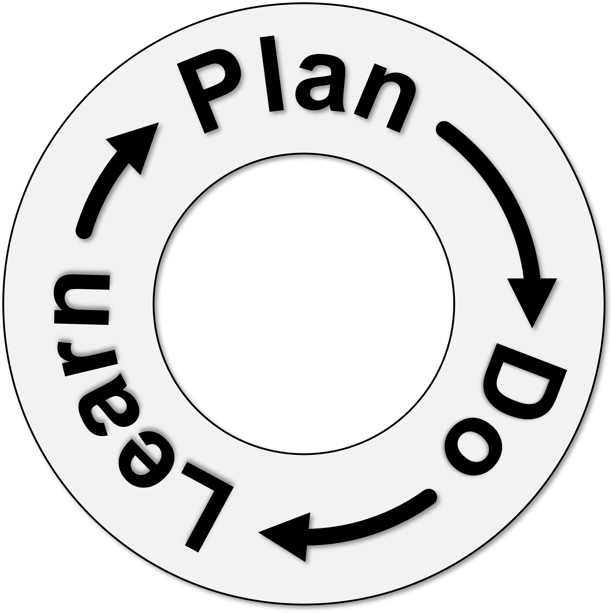

## Building from Week 3

**Last week:** Legitimate conservation decisions require attention to justice, participation, and governance.

**This week:** How do managers use evidence to plan, act, and learn?

::: notes
Time: 3 minutes. Source: Chapter 6, §§6.1–6.2. Retrieve the prior connection: authority and participation shape which problems are recognized and whose evidence counts.
:::

## The central question

::: {.fragment fragment-index=1}
How does a human-dimensions orientation improve an evidence-based management decision?
:::

::: {.fragment fragment-index=2}
It broadens both the evidence managers use and the outcomes they seek.
:::

::: notes
Time: 3 minutes. Source: Chapter 6, §§6.1–6.2. Ask students to listen for two threads today: evidence and problem framing.
:::

## Evidence and framing {background-color="#123f5a" .section-slide}

From a management question to a defensible plan.

::: notes
Time: 1 minute. Transition slide.
:::

## A decision needs more than biological evidence {.smaller}

::: columns
::: {.column width="50%"}
**What is happening?**

- Biological or ecological conditions
- Technical feasibility
- Legal mandates
:::

::: {.column width="50%"}
**What should be done?**

- Economic feasibility
- Social values
- Public knowledge and experience
:::
:::

::: {.fragment fragment-index=1}
**Key point:** These evidence sources complement one another; none resolves every management question alone.
:::

::: notes
Time: 6 minutes. Source: Chapter 6, §6.2.1. Emphasize balance rather than a hierarchy of evidence.
:::

## Four questions organize a decision

::: columns
::: {.column width="50%"}
**Why?**

Why manage or conserve this resource?

**Who?**

Which publics, beneficiaries, and partners are involved?
:::

::: {.column width="50%"}
**What?**

What impacts or outcomes are desired?

**How?**

How will the decision be made, carried out, and assessed?
:::
:::

::: notes
Time: 6 minutes. Source: Chapter 6, §6.2. Ask students which question is easiest to overlook when a decision is framed only as a biological problem.
:::

## Research and participation have different jobs

**Research** can describe conditions, relationships, and likely consequences.

**Participation** can reveal values, concerns, local knowledge, and acceptable tradeoffs.

::: {.fragment fragment-index=1}
::: {.key-idea}
Meaningful participation is more than a legal requirement. It needs a structured process, capable staff, and genuine integration of input.
:::
:::

::: notes
Time: 5 minutes. Source: Chapter 6, §6.2.1. Connect to Grand Staircase–Escalante: participation affects both information and legitimacy.
:::

## Plan–Do–Learn is iterative

{fig-alt="A circular cycle with three connected stages: Plan, Do, and Learn. Arrows show that learning feeds back into planning." height=380}

::: {.fragment fragment-index=1}
Learning can revise the action, the objectives, or even the original problem frame.
:::

::: notes
Time: 6 minutes. Source: Chapter 6, §6.3 and Figure 6.1. Explain the image in words before discussing it. The alt text provides the text equivalent.
:::

## Planning turns a broad concern into a choice {background-color="#2f6b57" .section-slide}

Clear framing, objectives, alternatives, and measures.

::: notes
Time: 1 minute. Transition slide.
:::

## Problem framing shapes the whole cycle

How a problem is framed influences:

- who is involved;
- what evidence is gathered;
- which alternatives are considered; and
- how success is measured.

::: {.fragment fragment-index=1}
Different frames can produce different, defensible management choices.
:::

::: notes
Time: 5 minutes. Source: Chapter 6, §§6.3–6.4. Have students apply why/who/what/how to the Puget Sound effort as a low-stakes preview.
:::

## Objectives, actions, and measures are not interchangeable {.compact}

::: columns
::: {.column width="33%"}
**Objective**

The desired change.

*Example:* Improve access.
:::

::: {.column width="33%"}
**Action**

What managers do.

*Example:* Restore a boat ramp.
:::

::: {.column width="33%"}
**Measure**

Evidence of change.

*Example:* Reported ability to access the site.
:::
:::

::: {.fragment fragment-index=1}
SMART objectives are specific, measurable, achievable, relevant, and time-bound.
:::

::: notes
Time: 7 minutes. Source: Chapter 6, §§6.3.2–6.3.2.2. Use the example only to distinguish the three terms; do not treat it as a Chapter 6 case claim.
:::

## Preparing for Friday: Puget Sound

The chapter's Puget Sound example follows a long-term recovery effort that considers ecological conditions and human well-being.

::: {.fragment fragment-index=1}
Come Friday ready to identify:

- the why, who, what, and how;
- one kind of evidence that matters; and
- one outcome worth monitoring.
:::

::: notes
Time: 4 minutes. Source: Chapter 6, Box 6.2. Preview only; Wednesday will develop implementation, monitoring, and the Human Well-being Vital Signs.
:::

## Exit check

An agency relies only on biological information to choose an action.

**Which of the four decision questions is most likely to be weakened—and why?**

::: notes
Time: 3 minutes. Source: Chapter 6, §6.2. Collect a short written response or pair-share. Close by previewing the Plan–Do–Learn cycle for Wednesday.
:::
