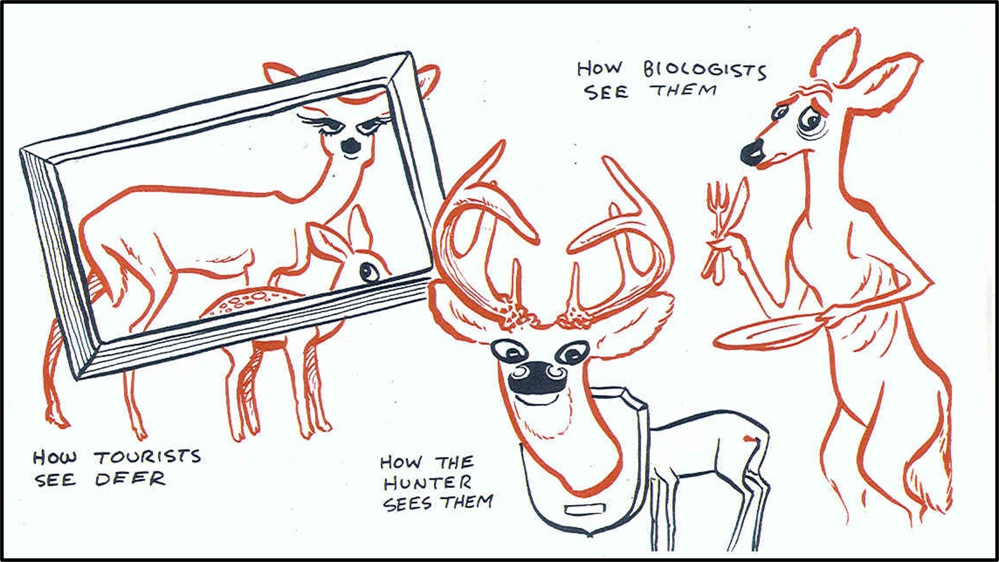

## Building from Monday

**Monday:** Evidence and framing shape a management plan.

**Today:** Implementation, monitoring, and evaluation show whether that plan works.

::: notes
Time: 3 minutes. Source: Chapter 6, §§6.3.3–6.3.4. Retrieve Plan–Do–Learn and ask students what could go wrong after a plan is adopted.
:::

## The central question

::: {.fragment fragment-index=1}
How can managers learn whether an action produced both ecological and human benefits?
:::

::: {.fragment fragment-index=2}
They need clear objectives, suitable measures, and a willingness to adapt.
:::

::: notes
Time: 2 minutes. Source: Chapter 6, §§6.3.3–6.3.4.2.
:::

## From plan to action {background-color="#123f5a" .section-slide}

Implementation is where a plan meets real conditions.

::: notes
Time: 1 minute. Transition slide.
:::

## Doing is more than announcing a plan

Implementation can include:

- rule-making and policy;
- habitat restoration;
- public involvement;
- law enforcement;
- surveys; and
- day-to-day professional decisions.

::: notes
Time: 5 minutes. Source: Chapter 6, §6.3.3. Explain that implementation occurs within legal mandates, agency missions, capacity, and constraints.
:::

## Plan–Do–Learn: each stage asks a different question {.smaller}

::: columns
::: {.column width="33%"}
**Plan**

What is the problem? What outcomes and alternatives matter?
:::

::: {.column width="33%"}
**Do**

What action will be carried out, by whom, and under what constraints?
:::

::: {.column width="33%"}
**Learn**

What changed? What should be adjusted next?
:::
:::

::: {.fragment fragment-index=1}
The cycle is not complete unless learning informs the next decision.
:::

::: notes
Time: 6 minutes. Source: Chapter 6, §6.3 and Figure 6.1. Invite students to trace one management decision through all three stages.
:::

## Monitoring and evaluation {background-color="#2f6b57" .section-slide}

Evidence for learning rather than evidence for its own sake.

::: notes
Time: 1 minute. Transition slide.
:::

## Monitoring and evaluation are linked

::: columns
::: {.column width="50%"}
**Monitoring**

Systematically and repeatedly collects information to guide future decisions.
:::

::: {.column width="50%"}
**Evaluation**

Determines whether goals, objectives, and success measures were met.
:::
:::

::: {.fragment fragment-index=1}
Monitoring supplies evidence; evaluation interprets it against the decision's objectives.
:::

::: notes
Time: 6 minutes. Source: Chapter 6, §§6.3.4–6.3.4.2. Ask why managers cannot use the terms as synonyms.
:::

## Measures should match the objective {.smaller}

::: columns
::: {.column width="50%"}
**Ecological measures**

- population or habitat indicators
- harvest levels
- other resource conditions
:::

::: {.column width="50%"}
**Human-dimensions measures**

- support and satisfaction
- license sales or days afield
- perceptions of fairness or access
:::
:::

::: {.fragment fragment-index=1}
An evidence-informed decision can require both kinds of measures.
:::

::: notes
Time: 5 minutes. Source: Chapter 6, §6.3.2.2. These are examples from the chapter, not a universal checklist.
:::

## What will count as success?

Before collecting data, managers need to decide:

1. What change is expected?
2. For whom should that change matter?
3. What evidence would show progress or a problem?
4. What decision could change in response?

::: notes
Time: 5 minutes. Source: Chapter 6, §§6.3.2–6.3.4. This slide synthesizes the chapter's planning and learning logic. Ask students which question is hardest to answer before implementation begins.
:::

## Chapter application: Puget Sound

The Puget Sound recovery effort combines ecological indicators with **Human Well-being Vital Signs**.

::: {.fragment fragment-index=1}
The effort involves agencies, Tribes, universities, practitioners, and other partners across the region.
:::

::: {.fragment fragment-index=2}
Its measures help partners see whether recovery is affecting people as well as ecological conditions.
:::

::: notes
Time: 6 minutes. Source: Chapter 6, Box 6.2. Keep claims within the box; this is the shared case for Friday.
:::

## Human Well-being Vital Signs {.smaller}

::: columns
::: {.column width="50%"}
- air quality and drinking water
- local foods and outdoor activity
- cultural well-being
- economic vitality
:::

::: {.column width="50%"}
- good governance
- sense of place
- stewardship behaviors
:::
:::

::: {.fragment fragment-index=1}
One indicator is not the whole story. Together, they broaden what recovery can mean.
:::

::: notes
Time: 5 minutes. Source: Chapter 6, Box 6.2. Ask pairs to select one indicator and explain why it belongs in a recovery effort.
:::

## Learning can change the next plan

{fig-alt="A diagram showing that problem framing influences the Plan, Do, and Learn stages of a management decision cycle, including who is involved, which evidence is gathered, the alternatives considered, and how success is measured." height=330}

::: {.fragment fragment-index=1}
New evidence may change the problem frame, objectives, implementation, or measures—not simply confirm the original plan.
:::

::: notes
Time: 5 minutes. Source: Chapter 6, §6.3.4 and Box 6.2. Explain the diagram in words. The alt text provides the text equivalent.
:::

## Friday: Puget Sound application

Prepare to explain:

1. the effort's why, who, what, and how;
2. one Human Well-being Vital Sign and its relevance;
3. one implementation or coordination feature; and
4. how monitoring could guide the next planning cycle.

::: notes
Time: 5 minutes. Source: Chapter 6, Box 6.2. Pair students to locate direct support in the box. Remind them that the next reading quiz is due Sunday night before Monday's class.
:::

## Close: what counts as a strong decision?

An evidence-informed decision is transparent about:

- its objectives;
- the evidence and values it uses;
- implementation constraints; and
- the ecological and human outcomes it will monitor.

::: notes
Time: 2 minutes. Source: Chapter 6, §§6.2–6.4. Close the week with the idea that learning is part of management, not a final add-on.
:::
