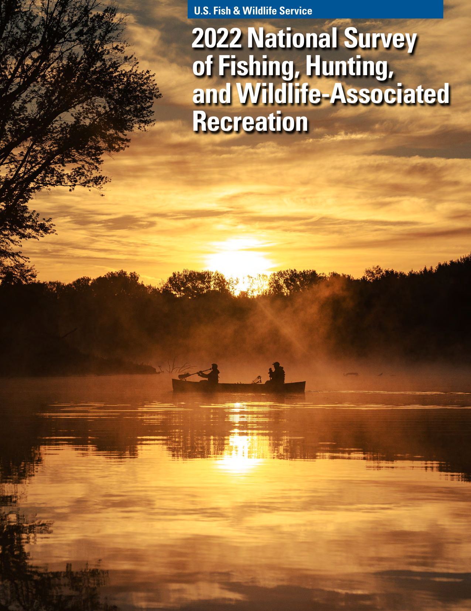
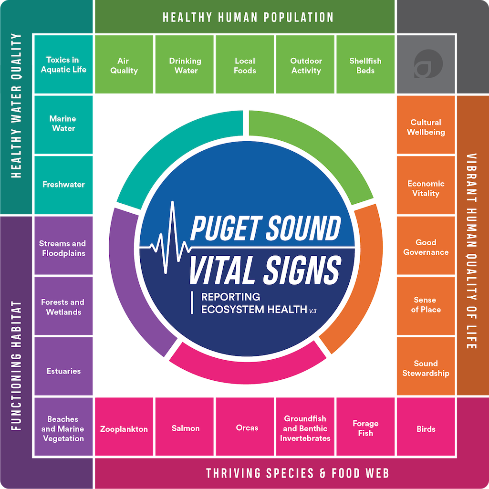

## What happens after a plan is adopted?

Monday asked how a management problem is framed and how evidence can shape a
plan.

 

**Today:** We follow the decision into the real work: choosing among
alternatives, carrying an action out, finding out what happened, and changing
course when necessary.

::: notes
Time: 2 minutes. Source: Chapter 6, §§6.3--6.3.4. Set up the distinction: today
is not a recap of Plan--Do--Learn. It asks how the process operates in real,
contested, and changing management settings.
:::

## By the end of class, you can

- explain what structured decision making makes visible in a contested
  management choice;
- distinguish implementation, monitoring, and evaluation in real management
  examples; and
- use both quantitative and qualitative evidence to diagnose what should change
  next.

::: notes
Time: 1 minute. Source: Chapter 6, §§6.3.1--6.3.4.2. These objectives map to the
three conceptual sections and the barbed-hook application near the end.
:::

## Plan--Do--Learn is a family of decision tools {.section-slide .divider-plan background-color="#123f5a"}

    Plan--Do--Learn is the shared iterative principle behind several
tools, not the only way to manage.

::: notes
Time: 0 minutes. Source: Chapter 6, §6.3 and Table 6.1. Transition from Monday's
generalized cycle to its concrete decision frameworks.
:::

## Different tools fit different management problems {.smaller}

- **Structured decision making:** clarifies objectives, alternatives,
  consequences, tradeoffs, and monitoring needs.
- **Adaptive management:** uses monitoring to reduce uncertainty and update
  recurring decisions.
- **Systematic conservation planning:** selects spatial areas and features
  suited to conservation goals.
- **Manager's model:** describes the social-ecological management system,
  problems, and desired conditions.
- **Open Standards:** applies a systematic, iterative conservation process.

::: {.source-note}
Source: Chapter 6, Table 6.1.
:::

::: notes
Time: 3 minutes. Source: Chapter 6, Table 6.1. Do not teach each tool in depth.
Ask which tool seems most useful when uncertainty is central, then clarify that
the point is fit, not a universal winner.
:::

## Structured decision making makes tradeoffs discussable

It does not remove conflict, uncertainty, or value differences.

It makes them visible by documenting:

- objectives and alternatives;
- evidence and assumptions;
- consequences and tradeoffs; and
- public input and how the decision will be evaluated.

 

::: {.key-idea}
🌟 Transparency is not agreement. It is being able to show what was considered,
what mattered, and how the decision can be revisited.
:::

::: notes
Time: 3 minutes. Source: Chapter 6, §6.3.1. Link directly to the course's
public-trust and governance work: a defensible process documents both the
decision and its reasoning.
:::

## Deer tags: the biological answer is not the whole decision

When population estimates decline, a state agency might consider:

- reducing tags statewide;
- changing tags only in selected management units;
- changing season timing;
- improving habitat; or
- pairing harvest prescriptions with hunter-access programs.

Each alternative can be compared using biological outcomes, hunter satisfaction,
perceived fairness, enforcement feasibility, and local economic effects.

::: {.source-note}
Source: Chapter 6, §6.3.1.
:::

::: notes
Time: 4 minutes. Source: Chapter 6, §6.3.1. This is the chapter's deer-tag
example. Ask: Which consideration disappears if we call the problem only
"declining deer numbers"? Do not ask students to select a preferred alternative.
:::

## Do: implementation is a stream of decisions {.section-slide .divider-do background-color="#2f6b57"}

    Implementation turns plans into action but it is not one single
action.

::: notes
Time: 0 minutes. Source: Chapter 6, §6.3.3. Transition to the practical work of
carrying out a decision.
:::

## Where implementation actually happens

Implementation happens in multiple places:

- formal rules and regulations;
- administrative policies and program delivery;
- meetings with publics, habitat restoration, enforcement, and surveys; and
- routine field-level choices made within plans, policies, and legal mandates.

 

::: {.key-idea}
🌟 "Doing" tests whether a plan is practical and relevant in its social,
political, legal, and ecological context.
:::

::: notes
Time: 3 minutes. Source: Chapter 6, §6.3.3. Ask students to identify which of
these is most visible to a member of the public, and which might be invisible
but still shape the outcome.
:::

## Emergency action still needs accountability

During highly pathogenic avian influenza outbreaks, an agency may have to:

- restrict wetland access;
- suspend hunting seasons; or
- impose carcass-transport rules quickly and with limited input.

  Participation is not always possible in an emergency. Agencies still need
to explain the action, assess what happened, and learn from the response.

::: {.source-note}
Source: Chapter 6, §6.3.3.
:::

::: notes
Time: 3 minutes. Source: Chapter 6, §6.3.3. This is a useful bridge to
governance next week: authority, urgency, transparency, and later evaluation all
matter even when ordinary participation cannot occur.
:::

## Waterfowl zones show why implementation is social

Setting waterfowl hunting zones can require managers to balance:

- migration timing and population health;
- when and where hunters prefer to hunt;
- flyway guidance, harvest data, and migration models; and
- input from surveys, advisory panels, or public comments.

  The final rule is one event. The implementation process is much larger.

::: {.source-note}
Source: Chapter 6, §6.3.3.
:::

::: notes
Time: 3 minutes. Source: Chapter 6, §6.3.3. Ask students to name one biological
and one social consideration in the example. Emphasize that both are part of
carrying out a defensible decision.
:::

## Learn: monitoring records change; evaluation explains it {.section-slide .divider-learn background-color="#123f5a"}

    Monitoring records change. Evaluation explains what that change means
for the next decision.

::: notes
Time: 0 minutes. Source: Chapter 6, §6.3.4. Transition from what agencies do to
what they can learn from the results.
:::

## Monitor an objective, not just what is easy to count

A mule-deer plan set an objective to increase hunter satisfaction by 10% over
five years. Managers could adjust seasons and harvest rules, then use annual or
biennial post-season surveys to track encounters, satisfaction, and harvest
rates before and after implementation.

   

::: {.key-idea}
🌟 The objective supplies the reason to monitor; the repeated design makes
change interpretable.
:::

::: {.source-note}
Source: Chapter 6, §6.3.4.1.
:::

::: notes
Time: 4 minutes. Source: Chapter 6, §6.3.4.1. Have students identify the
objective, action, and three monitored outcomes. This is a concrete example of a
human-dimensions measure tied to a management action.
:::

## Long-term social monitoring can reveal a changing public

The National Survey of Fishing, Hunting, and Wildlife-Associated Recreation has
tracked participation, demographics, expenditures, and motivations roughly every
five years since 1955.

 

::: {.columns}
::::: {.column width="63%"}
Those data reveal changes in participation, access, and recreation---including
growth in non-consumptive activities---and can prompt agencies to reconsider
recruitment, retention, and funding strategies.
:::::

::::: {.column width="37%"}
{fig-alt="Cover of the 2022 National Survey of Fishing, Hunting, and Wildlife-Associated Recreation, showing two anglers in a boat on golden water." height=340}
:::::
:::

::: {.source-note}
Source: Chapter 6, §6.3.4.1; U.S. Fish and Wildlife Service, *2022 National
Survey of Fishing, Hunting, and Wildlife-Associated Recreation* (public domain).
:::

::: notes
Time: 3 minutes. Source: Chapter 6, §6.3.4.1. This slide lets students see
monitoring as more than evaluating one project. Ask: What agency assumption
could become outdated if the public changes but the agency does not track it?
:::

## Evaluation asks a harder question

> Did we accomplish what we set out to do?

 

Numbers such as license sales, harvest, population estimates, participation
rates, and survey scores are useful benchmarks.

 

But numbers alone may not explain **why** an outcome occurred, whose experience
is missing, or whether the monitoring system itself has a blind spot.

::: notes
Time: 3 minutes. Source: Chapter 6, §6.3.4.2. Distinguish this from the earlier
monitoring definition: evaluation interprets evidence against goals, objectives,
and success metrics.
:::

## Qualitative evidence can test the monitoring system

Two examples show how qualitative evidence can matter:

- Interviews in Arizona surfaced values and concerns that culturally narrow
  survey questions missed---questions about whether people see wildlife mainly
  as a resource for human use or as part of a broader moral community.
- Interviews with fishing captains uncovered gaps between observed bycatch and
  what monitoring programs officially recorded, as well as reduction practices
  absent from agency data.

::: {.key-idea}
🌟 Qualitative evidence can explain a numerical pattern---or show that the
pattern is incomplete.
:::

::: {.source-note}
Source: Chapter 6, §6.3.4.2.
:::

::: notes
Time: 4 minutes. Source: Chapter 6, §6.3.4.2. Ask students why a manager should
not treat interviews as merely "anecdotes" when they identify a flaw in a
measurement system. Keep the discussion about complementarity, not a competition
between methods.
:::

## Puget Sound: monitoring human well-being takes infrastructure

::: {.columns}
::::: {.column width="58%"}
The Human Well-being Vital Signs were developed through a multi-year
collaborative social-science process tied to regional recovery goals.

 

The system combines existing agency data with a state-funded biennial survey of
9,000 residents across 12 counties. Questions were pilot-tested and reviewed by
a Social Science Advisory Committee.
:::::

::::: {.column width="42%"}
   
{fig-alt="Puget Sound Vital Signs framework. Its human-wellbeing measures include local foods, outdoor activity, cultural wellbeing, economic vitality, good governance, sense of place, and sound stewardship; it connects these to measures of water, habitat, species, and food-web health." height=330}
:::::
:::

::: {.source-note}
Source: Chapter 6, Box 6.2; Puget Sound Partnership, *Puget Sound Vital Signs*.
:::

::: notes
Time: 4 minutes. Source: Chapter 6, Box 6.2. This is the richer Puget Sound
story: who built the indicators, how they are measured, and why they can be used
alongside ecological monitoring.
:::

## The point of the Puget Sound indicators

They have helped the Partnership:

- evaluate residents' experiences, behaviors, and perceived quality of life
  alongside ecological conditions;
- generate additional human-dimensions research;
- create an internal social-science position; and
- incorporate human-well-being priorities into recovery planning.

This is what it looks like when monitoring changes an institution's capacity to
make decisions.

::: {.source-note}
Source: Chapter 6, Box 6.2.
:::

::: notes
Time: 2 minutes. Source: Chapter 6, Box 6.2. Avoid claiming that every vital
sign changed. The chapter reports many stable results; its central lesson is
that social indicators changed what the recovery system could see and do.
:::

## Apply it: the barbed-hook decision {.section-slide .divider-apply background-color="#2f6b57"}

Try the process on one final decision problem.

::: notes
Time: 0 minutes. Source: Chapter 6, §6.5, Review Question 3. Transition to an
active-learning prompt using the chapter's own scenario.
:::

## Case: restart a decision process

A state wildlife agency banned barbed hooks on a popular river fishery.

An angler survey later found that local publics were upset, felt they could no
longer catch fish, and believed they had not been properly consulted.

In groups of three, prepare a two-minute response:

1. What did the original process fail to learn **before** implementation?
2. What biological and social evidence would you gather if you restarted it?
3. What would you monitor and evaluate after a revised decision?

::: notes
Time: 7 minutes. Source: Chapter 6, §6.5, Review Question 3. Have students use
the why/who/what/how framework from Monday, but require one concrete biological
and one social evidence source. Then call on two groups: one to name a
pre-decision failure, one to explain an after-implementation learning plan.
:::

## Friday: use Puget Sound as a decision system

For Friday, your group will use the Puget Sound evidence system to:

1. frame one specific recovery or restoration decision;
2. connect a Human Well-being Vital Sign to an affected perspective;
3. recommend an implementation or coordination action and a tradeoff; and
4. state what evidence would require a revised plan.

::: notes
Time: 2 minutes. Source: Chapter 6, Box 6.2. Make the bridge explicit: Friday is
not an indicator-identification exercise. Students must use the evidence system
to justify a decision and a revision trigger.
:::

## Close: learning changes the next decision

A defensible management process does not merely collect more information.

 

It makes objectives, alternatives, tradeoffs, implementation conditions, and
outcomes visible enough that an agency can explain **what it will do differently
next time**.

::: notes
Time: 1 minute. Source: Chapter 6, §§6.3.1--6.3.4.2. Close on the chapter's
throughline: transparency, accountability, and adaptive decision-making depend
on linking information to an actual next choice.
:::
