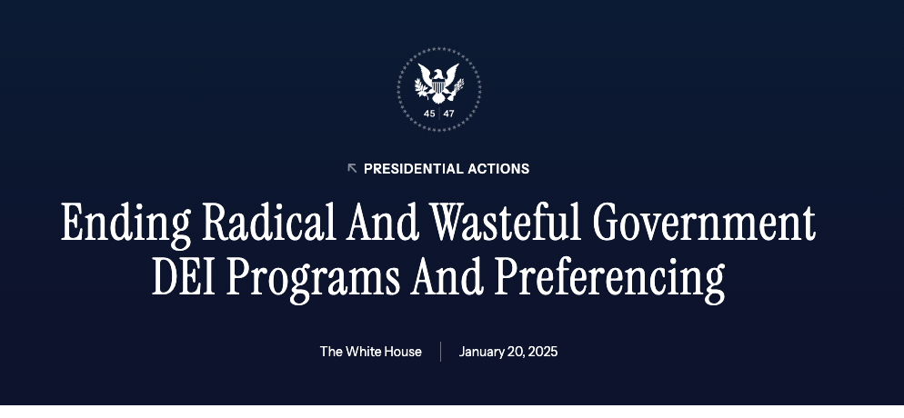
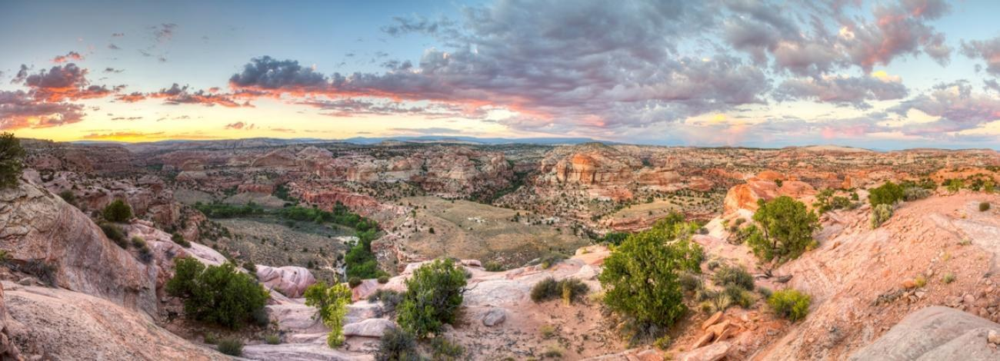

## Why this comes after evidence and learning

Week 4 asked how a management problem is framed, how evidence enters a plan, and
how monitoring changes the next cycle.

 

This week asks the prior question: **who is in that process, whose knowledge is
taken seriously, and who is able to influence the result?**

::: notes
Time: 2 minutes. Source: Chapter 4, §4.2. Confirm that the Week 5 quiz covers
Chapters 4 and 5 and is due Sunday at 11:59 p.m. Tell students that Monday is
Chapter 4 and Wednesday is Chapter 5, and that Friday uses a new case brief they
must read before class.

**Pacing.** Full deck is 62 minutes; the core path is 49. Five slides are marked
"If time is short, skip this slide" --- the "first" slide, the
exclusionary-process slide, protected areas, reasserting local control, and Box
4.3. Drop from the bottom of that list up. Protect the last three slides: the
pair rehearsal is the direct rehearsal for Friday item 1, and the Friday preview
carries the case-brief reading expectation.
:::

## Today's question

How do diversity, equity, inclusion, and justice shape whether a conservation
decision is legitimate and durable?

::: notes
Time: 1 minute. Source: Chapter 4, §4.1. Position DEIJ as part of management
practice rather than as a separate policy topic layered on top of it.
:::

## What you should be able to do

By the end of today, you should be able to:

- distinguish diversity, equity, inclusion, and justice;
- explain why representation, capacity, and relevancy matter to the profession;
- tell the difference between presence in a process and influence over it; and
- name one guideline for working across knowledge traditions.

::: notes
Time: 1 minute. Source: Chapter 4, §§4.2--4.5. These four objectives map onto
the four sections of today's class and onto the first two prompts of Friday's
application.
:::

## Justice is a management condition {.section-slide background-color="#123f5a"}

Access, influence, and recognition shape whether a conservation decision can be
publicly legitimate.

::: notes
Time: 1 minute. Source: Chapter 4, §4.2. Do not present DEIJ as separate from
ecological outcomes or implementation.
:::

## DEIJ is part of management practice

DEIJ shapes:

- access to land and water;
- whose knowledge is recognized;
- who bears costs and receives benefits; and
- who has influence in public processes.

::: notes
Time: 3 minutes. Source: Chapter 4, §4.2. Do not reduce DEIJ to representation
alone. Ask students what each bullet would look like in a specific decision: a
boat ramp, a permit draw, a comment period, a restoration contract.
:::

## Four related terms

- **Diversity:** varying attributes within a community.
- **Equity:** fair opportunity to engage and benefit, including attention to
  barriers.
- **Inclusion:** being accepted, supported, and able to contribute.
- **Justice:** fair practices that dismantle barriers and enable full
  participation.

::: notes
Time: 4 minutes. Source: Chapter 4, Table 4.1. This is a text equivalent for
Table 4.1. Ask students to distinguish equity from equality using only these
definitions. Then ask which of the four is hardest for an agency to claim it has
achieved, and why.
:::

## The four terms are not interchangeable

 

::: {.key-idea}
Institutions are sometimes criticized for emphasizing diversity and inclusion,
which are more widely accepted, while avoiding the deeper questions of equity
and justice that challenge existing power structures.
:::

::: notes
Time: 2 minutes. Source: Chapter 4, §4.4. This is the chapter's own caution. Use
it to explain why a demographic count is not, by itself, evidence of equity. It
is a claim about institutional behavior, not about individuals.
:::

## Why DEIJ matters to the profession

Chapter 4 gives three practical reasons:

- **capacity:** who enters, stays, and leads in the profession;
- **representation:** whether the profession reflects the publics it serves; and
- **relevancy:** whether conservation institutions can respond to changing
  communities, values, and relationships with nature.

::: notes
Time: 3 minutes. Source: Chapter 4, §§4.3.1--4.3.3. Avoid treating these as
recruitment-only questions. Professional composition and institutional culture
affect the ability to recognize a problem, build a relationship, and act.
:::

## A "first" is rarely enough

Numerical representation does not always translate into organizational
influence.

- Organizations need a **critical mass** of diverse voices to support innovation
  and belonging.
- Critical mass may still fail to change direction unless people reach **formal
  leadership roles**.
- Without sustained change, people experience **tokenism**: inclusion as a
  symbolic representative rather than as a full participant.

::: notes
Time: 3 minutes. Source: Chapter 4, §4.4.1. The chapter names Hallie M. Daggett,
Charles Young, and Deb Haaland as "firsts." Use them to make the point that a
first is a threshold, not a culture change. Do not ask students to disclose
their own identity or experience.

**If time is short, skip this slide.** The thread survives without it.
:::

## Internal and external DEIJ work

::: columns
::::: {.column width="50%"}
**Internal**

Hiring, retention, leadership development, workplace culture, institutional
policy. Often top-down.
:::::
::::: {.column width="50%"}
**External**

How agencies work with publics, communities, Indigenous nations, and partners.
Often bottom-up, driven by publics asserting rights, values, and knowledge.
:::::
:::

Both face real constraints. Both are necessary.

::: notes
Time: 2 minutes. Source: Chapter 4, §4.4. Friday's case brief is an external
DEIJ problem: a planning process, not a hiring process. The next two slides take
up the changing legal landscape for internal DEIJ work since 2025.
:::

## The 2025 executive orders

{fig-alt="Header of a White House Presidential Actions page. The presidential seal appears above the label PRESIDENTIAL ACTIONS and the title 'Ending Radical And Wasteful Government DEI Programs And Preferencing', attributed to The White House and dated January 20, 2025." width="88%"}

EO 14151 and EO 14148, both signed January 20, 2025. An executive order directs
the **executive branch**; it is not a statute or a court ruling.

::: notes
Time: 4 minutes. Source: Chapter 4, §4.4; Chapter 5, §5.5.1. Set the frame out
loud before advancing.

**We are studying a governance mechanism and its documented effects on the
profession, not evaluating the policy.** No student is asked to state a
position. If one volunteers, acknowledge it and return to the mechanism. If
asked what you think, decline plainly --- the question this course answers is
what an agency can and must do, and how a professional works inside that.

The image is cropped to the document header; the surrounding site navigation is
not part of the order. Read the title as data: the language an instrument uses
about itself shows how the issuing authority frames the problem, which is
separate from what it operationally does.

Three factual points, all mechanism and none of them an argument. Chapter 5
lists executive orders among the tools used to guide agency priorities.
Civil-rights statutes --- the Civil Rights Act, the Equal Pay Act --- are
unchanged by an order; courts, not orders, determine what the law is. And an
order can be rescinded by a later one: EO 14151 itself rescinds EO 13985.

Mention the state-level parallel in one sentence so this does not read as being
about one administration: Chapter 4 pairs the federal orders with Alabama's
Senate Bill 129, which prohibited DEI offices and the teaching of what the bill
termed "divisive concepts," restructuring programming at universities feeding
that state's conservation workforce. Similar bills appeared in multiple states.
:::

## What it means for fish and wildlife

Chapter 4 reports three effects on the profession: DEI-related **programs were
suspended** across executive-branch agencies; restrictions on university
programming affect the **workforce pipeline**; and TWS noted that **layoffs of
early-career professionals** may hinder management of public lands and trust
resources.

::: {.key-idea}
The profession adopted its own position first. TWS's workforce-diversity
position statement dates to **October 2020**, and argues from management
effectiveness: engaging a greater proportion of the population lets us "more
effectively manage wildlife, the ecosystems on which they depend, and the human
communities that interact with them."
:::

::: notes
Time: 4 minutes. Source: Chapter 4, §4.4; Arnett et al. 2025; Rodgers and Arnett
2025; TWS Position Statement on Workforce Diversity (2020). Keep the three
effects as reported events with sources, which is what they are. Note TWS's
framing: a concern about capacity to manage trust resources is a professional
argument, not a partisan one. Connect back to §4.3 --- capacity, representation,
relevancy. Whatever a student concludes about the orders, an agency that loses
staff and pipeline has a capacity problem, and capacity determines whether it
can do the work.

The 2020 date is the point of the key-idea box. The societies reached this
position independently and four years earlier, on effectiveness grounds. In
early 2025 TWS, the American Fisheries Society, the Society of American
Foresters, and the Society for Range Management issued a joint statement warning
of long-term impacts.

TWS runs this operationally: Trailblazer Grants, the Native Student Professional
Development Program, an Ombuds, and working groups including Women of Wildlife
and Out in the Field. Several are open to students in this room --- name them,
since that is the concrete reason to care.

If time allows: "You are a district biologist in 2027. Your engagement program
was suspended and your partnership contacts are gone. Chapter 4 says relevancy
is a condition of effective management. What do you do?"
:::

## Presence is not influence {.section-slide background-color="#2f6b57"}

A process can include people without sharing influence.

::: notes
Time: 1 minute. Source: Chapter 4, §4.4.2. This is the distinction Friday's
application turns on.
:::

## Presence only, or meaningful inclusion?

::: columns
::::: {.column width="48%"}
**Presence only**

People are invited, but barriers limit their participation or their knowledge
has no effect on the decision.
:::::
::::: {.column width="52%"}
**Meaningful inclusion**

Relevant publics can participate, their knowledge is recognized, and the process
makes clear how their input can affect the decision.
:::::
:::

::: notes
Time: 3 minutes. Source: Chapter 4, §§4.2--4.3. Ask: "What would make an
invitation insufficient?" Listen for access barriers, timing, token
participation, recognition, and lack of meaningful influence. Do not require
personal disclosure.
:::

## Participation has to be designed, not announced

- Identify affected publics and barriers to access.
- Engage **early enough** for input to shape the problem and the alternatives.
- Explain the **scope of influence** and how input was used.
- Build collaboration and accountability into the continuing relationship.

::: notes
Time: 3 minutes. Source: Chapter 4, §4.4.2. Be clear that meaningful
participation does not mean every participant receives the outcome they prefer.
It means the process could have changed because of what they said.
:::

## When a process is seen as exclusionary

Publics use many routes to assert influence: activism, protest, media, lobbying,
public comment, public relations, and community organizing.

 

::: {.key-idea}
Bottom-up participation is often a response to a process that did not share
influence in the first place.
:::

::: notes
Time: 2 minutes. Source: Chapter 4, §4.4.2. Frame these as governance signals
rather than as obstacles. If an agency is surprised by organized opposition,
that is information about the process it ran.

**If time is short, skip this slide.** The thread survives without it.
:::

## Protected areas show the stakes

Protected areas established without local consent often lack enduring public and
political support. They can become:

- vulnerable to **PADDD** --- downgrading, downsizing, and degazettement; or
- **"paper parks"** that exist on a map but lack the legitimacy needed for
  actual protection.

::: notes
Time: 2 minutes. Source: Chapter 4, §4.4.2. Define both terms plainly. The point
is that a legitimacy deficit has a material conservation consequence, not only a
political one.

**If time is short, skip this slide.** The thread survives without it.
:::

## Grand Staircase--Escalante {.smaller}

- Designated in 1996 to protect an ecologically rich landscape.
- Many local communities and Indigenous nations felt they were **not
  sufficiently consulted**.
- Reduced by nearly 50% in 2017 through executive action.
- Critics point to the lack of local engagement and long-term political
  consensus as key factors.

{.nostretch fig-alt="Panoramic view across Grand Staircase--Escalante at sunset. Pale sandstone ledges and scattered juniper in the foreground drop into a green canyon bottom, with banded red and white cliffs and mesas receding to the horizon under a broken pink and grey sky." width="64%"}

::: {.source-note}
Instructional content: Chapter 4, §4.4.2. Illustrative image: [Bureau of Land Management](https://www.blm.gov/programs/national-conservation-lands/utah/grand-staircase-escalante-national-monument).
:::

::: notes
Time: 3 minutes. Chapter 4, §4.4.2. Use only these case facts; do not supply
external policy detail. Ask students which of the four design rules on the
earlier slide appears to have been missed.

The photograph is scene-setting only and carries no instructional content --- a
student who cannot see it loses nothing, which is why the alt text describes the
landscape rather than making an argument. Give students a beat to look at it
before starting: most have never seen this landscape, and the scale is part of
why the designation and the reduction both mattered so much locally.

Note for the instructor: this slide writes its footer as an explicit source-note
div, because the footer has to carry the image credit as well. Keep the citation
keyword out of these speaker notes or the footer filter will add a second,
overlapping line.

Image provenance: the photograph is from the BLM's Grand Staircase--Escalante
page. Works of the U.S. government are in the public domain, and that page
showed no separate photographer credit or licence statement when it was
checked. If BLM later attributes it to a named contributor, update the footer
credit to match.
:::

## The other direction: reasserting local control

Communities also use protected areas to reassert authority and sustain
relationships:

- Grand Portage Band of Lake Superior Chippewa comanaging a national monument
  with the National Park Service;
- transfer of the National Bison Range to the Confederated Salish and Kootenai
  Tribes; and
- the Indigenous Circle of Experts in Canada.

::: notes
Time: 2 minutes. Source: Chapter 4, §4.4.2. This prevents the section from
reading as a catalogue of failure. Comanagement returns on Wednesday as a
governance arrangement between sovereigns.

**If time is short, skip this slide.** The thread survives without it.
:::

## Box 4.3 --- Salmon justice

For more than a century, Tribes in the Pacific Northwest have fought for the
right to harvest salmon and steelhead and to sustain their communities around
these fisheries.

- Timber, mining, agriculture, hydropower, and commercial fishing transformed
  the rivers and devastated the runs.
- Losses were ecological, economic, **cultural, and spiritual** --- salmon is a
  primary "first food."
- Because many Tribal members eat more locally caught fish, contaminant risk can
  exceed what regulatory standards assume.
- A 2023 federal settlement shifted control of restoration funds toward Tribal
  governments.

::: notes
Time: 4 minutes. Source: Chapter 4, Box 4.3. Use this box to show that
conservation, treaty rights, public health, and justice are one connected
problem. Note the last bullet: who controls the money is a justice question and
a governance question, which is Wednesday's bridge.

**If time is short, skip this slide.** The thread survives without it.
:::

## Knowledge traditions {.section-slide background-color="#123f5a"}

Disciplines, fields of study, and intergenerational ways of knowing that shape
how people relate to the natural world.

::: notes
Time: 1 minute. Source: Chapter 4, §4.5. Name the five the chapter treats:
Indigenous knowledge systems, racial and ethnic studies, women and gender
studies, queer studies, and disability studies.
:::

## The Six Rs

Many North American Indigenous knowledge systems summarize their research and
relationship principles as:

**respect · relationship · relevance · reciprocity · responsibility ·
representation**

::: notes
Time: 2 minutes. Source: Chapter 4, §4.5.1.1. These are practice standards for
how inquiry is conducted and how relationships are maintained, not a checklist
an outside researcher completes once. Connect reciprocity to the chapter's
Kimmerer example.
:::

## Work across knowledge traditions with humility

{fig-alt="Five principles for working across knowledge traditions in conservation: ask whose work is being built on; recognize limits of expertise; understand epistemology; remember knowledge is positional and relative; and balance inquiry and practice." height=620}

::: notes
Time: 2 minutes. Source: Chapter 4, Figure 4.1. Read the alt text aloud as the
text equivalent. Ask which principle matters most for Friday's case and why.
:::

## The same guidelines, in words

- Identify whose work and knowledge you are building on.
- Recognize the limits of your expertise.
- Understand epistemology --- how a tradition decides what counts as knowing.
- Remember that knowledge is positional and relative.
- Balance inquiry with practice.

::: {.key-idea}
This is a practice standard, not an invitation to treat every knowledge claim as
interchangeable.
:::

## Pair rehearsal: presence or influence?

With a partner, take one of these and decide whether it is **presence only** or
**meaningful inclusion**, and say what would have to change:

1. A 30-day comment period on a completed draft plan.
2. A standing basin council that sets its own agenda but cannot decide.
3. A comanagement agreement that gives a sovereign partner a decision role.

::: notes
Time: 5 minutes. Two minutes to decide, then hear one response for each. The
useful answer names what would have to change, not just the label. Each of these
three appears in Friday's case brief as an option, so this is direct rehearsal.
:::

## Wednesday and Friday

**Wednesday:** Chapter 5 --- the governance machinery that decides who *can*
share influence, and what it costs.

 

**Before Friday:** read the **Week 05 Case Brief: the Cottonwood River Access
and Restoration Plan**. It is a separate document in the Canvas module and is
required preparation.

::: notes
Time: 1 minute. Source: Chapters 4--5. Say explicitly that Friday's application
is answered from the case brief, not from outside research, and that group and
role assignments are already published.
:::

## Close: a management standard

Conservation decisions are more durable when they are ecologically sound **and**
publicly accountable to diverse publics, authorities, and contexts.

::: notes
Time: 1 minute. Source: Chapter 4, §4.6. Restate the quiz deadline and the
case-brief reading expectation.
:::
