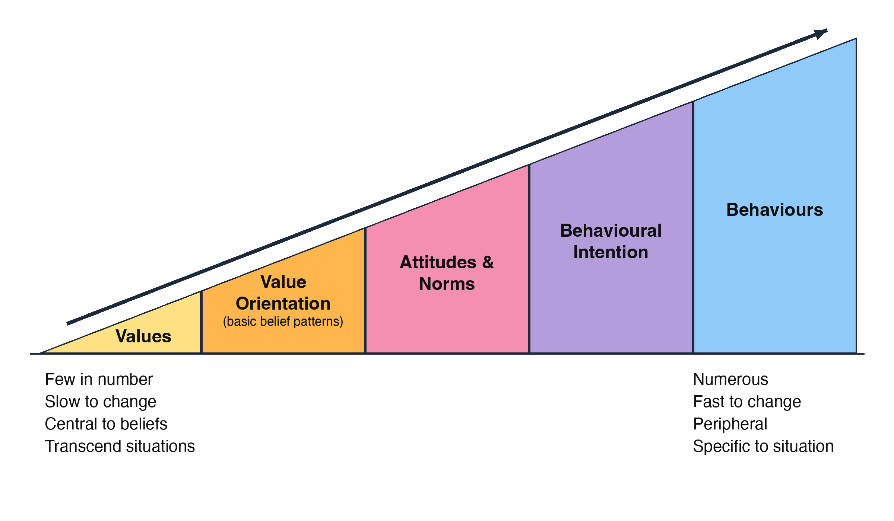
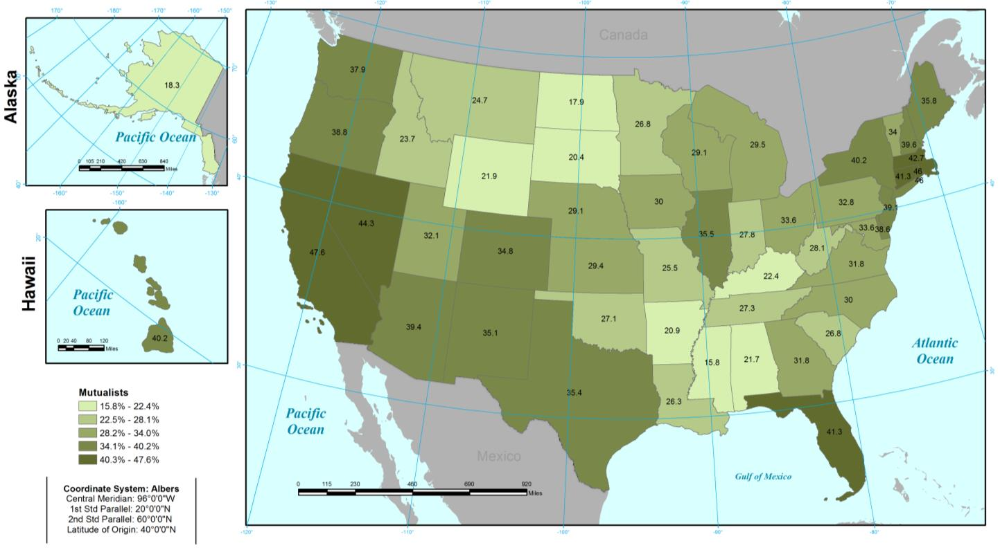
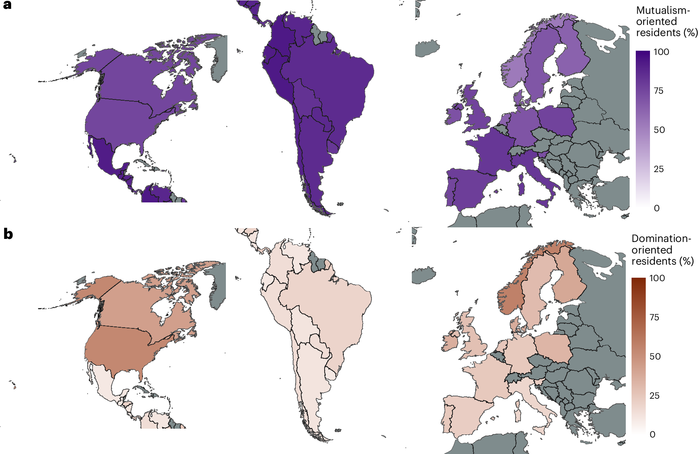

## "They just need to care more"

You will hear this sentence in a management meeting. It is almost always wrong ---
not because caring is irrelevant, but because the people in question usually
already care.

 

This week asks what else has to be true before a person acts.

::: notes
Time: 2 minutes. Source: Chapter 8, §8.2. Ask for a show of hands: who has been
told to do something they already believed in, and did not do it? That is the
whole week in one question.

**Pacing.** Full deck is 52 minutes; the core path is 49. Slides marked "If time
is short, skip this slide" are the drop list: the "five jobs" slide. Protect the
person-and-situation slide and the worked contrast --- they are the week's core
and the rehearsal for Friday item 2.
:::

## Today's question

What does psychology add once we already know that people support a conservation
goal?

::: notes
Time: 1 minute. Source: Chapter 8, §8.2. Position psychology as diagnostic: it
tells you *which part* of the chain is broken, which determines which
intervention could possibly work.
:::

## What you should be able to do

 

By the end of today, you should be able to:

- distinguish **cognition**, **conation**, and **affect**;
- explain the **person** and the **situation** as two interacting lenses;
- explain the **cognitive hierarchy** from values to specific behavior; and
- state the **specificity principle** and why it matters for prediction.

::: notes
Time: 1 minute. Source: Chapter 8, §§8.3--8.4.1. Wednesday adds the frameworks
that turn this diagnosis into a strategy.
:::

## What psychology is for {.section-slide background-color="#123f5a"}

 

It connects individual thought and behavior to practical management problems.

::: notes
Time: 1 minute. Source: Chapter 8, §8.2.
:::

## Five jobs psychology does in management

- **Designing interventions** --- targeting the actual drivers of action.
- **Enhancing participation** --- uncovering what motivates or discourages
  different publics.
- **Managing conflict** --- understanding the roots of conflict among people,
  groups, and institutions.
- **Contextual planning** --- making plans relevant to local communities.
- **Informing decisions** --- cognitive biases, emotions, bounded rationality,
  and uncertainty.

::: notes
Time: 3 minutes. Source: Chapter 8, §8.2. Each of these connects forward to a
later chapter: participation to Chapter 13, conflict to Chapter 18, decisions to
Chapter 6. Psychology is not a detour from management; it is the diagnostic
layer under it.

**If time is short, skip this slide.** The thread survives without it.
:::

## A caution before we start

 

Most classic disciplines, psychology included, emerged within Western cultures
and ways of knowing. There is often an implicit assumption that those concepts
apply universally.

 

::: {.key-idea}
**Cultural relevance:** the degree to which a practice, intervention, or program
is tailored to the specific cultural backgrounds, values, and experiences of a
community.
:::

::: notes
Time: 3 minutes. Source: Chapter 8, §8.2.1. Cross-cultural psychology tests
whether dominant Western concepts hold in other contexts. Connect back to Week
6's treatment of Indigenous ways of knowing: the question of whether a construct
travels is an epistemological question, not a translation problem.
:::

## Three components of mental life {.section-slide background-color="#2f6b57"}

 

Cognition · conation · affect

 

*Thinking, motivation, and emotion shape how we understand and respond to the
world.*

::: notes
Time: 1 minute. Source: Chapter 8, §8.3.
:::

## Cognition, conation, affect

Motivational and volitional drive: will, intent, striving

 

  | Component     | What it is                                                | A question that reveals it                            |
  | ---           | ---                                                       | ---                                                   |
  | **Cognition** | Mental processes: perception, reasoning, memory           | "Do you think draining your boat makes a difference?" |
  | **Conation**  | Motivational and volitional drive: will, intent, striving | "Do you intend to do it on your next trip?"           |
  | **Affect**    | The experience of emotions and feelings                   | "How do you feel when you see the agency's sign?"     |

 

These interact to form internal states --- beliefs and attitudes --- which then
appear as observable decisions and actions.

::: notes
Time: 6 minutes. Source: Chapter 8, §8.3. Spend the time here; students
routinely collapse all three into "attitude." Work an example across all three
columns. Stress that affect is a relative newcomer to the field and is not a
softer version of cognition.
:::

## The person and the situation

 

::: columns
::::: {.column width="50%"}
**The person**

Intrapersonal factors. Internal explanations for thought and behavior.
:::::
::::: {.column width="50%"}
**The situation**

Interpersonal and situational factors. The social or biophysical structures that
explain thought and behavior.
:::::
:::

 

::: {.key-idea}
The person and the situation are **inseparable**. Social and cognitive
psychology explain behavior by analyzing how the two interact.
:::

::: notes
Time: 5 minutes. Source: Chapter 8, §8.3. This is the single most important
slide of the week. The failure mode in management is locating the whole problem
in the person --- "they don't care," "they're lazy" --- when the situation
produced the behavior. The opposite failure is real too: removing every barrier
and being surprised that nothing changed.
:::

## A worked contrast

A landowner **wants** to secure bear attractants but has nowhere secure to store
them.

 

::: {.fragment}
Diagnosing this as a values problem produces a brochure.
:::

 

::: {.fragment}
Diagnosing it as a situational constraint produces storage.
:::

 

::: {.fragment}
::::: {.key-idea}
The same observed behavior --- attractants left out --- supports two completely
different interventions. Only one of them can work.
:::::
:::

::: notes
Time: 4 minutes. Source: Chapter 8, §8.3. Reveal the fragments one at a time and
let students commit before the third. This is the direct rehearsal for Friday's
item 2.
:::

## The cognitive hierarchy {.section-slide background-color="#123f5a"}

 

How broad beliefs and values connect to specific attitudes and behaviors

 

*From abstract and stable to specific and situational.*

::: notes
Time: 1 minute. Source: Chapter 8, §8.4.1 and Box 8.5.
:::

## From values to behavior

 

::: {.columns}
::::: {.column .compact width="40%"}
- **Values** are few, abstract, and stable across a life.
- **Value orientations** are patterns among basic beliefs --- the link between
  abstract values and specific cognitions.
- **Attitudes and norms** are specific to an object or an action.
- **Intention** is the most immediate predictor of behavior.
:::::
::::: {.column width="60%"}
{width="100%" fig-alt="The cognitive hierarchy moves from values to value orientations (basic belief patterns), attitudes and norms, behavioral intention, and behavior. Values are few, slow to change, central to beliefs, and transcend situations. Toward behavior, cognitions become more numerous, faster to change, peripheral, and specific to the situation."}
:::::
:::

::: notes
Time: 5 minutes. Source: Chapter 8, §8.4.1, Figure 8.1, and Box 8.5. Wildlife
value orientations are the best-known application in this field. Walk through
Figure 8.1 from left to right: few abstract values connect to many specific
cognitions, which is why values change slowly and attitudes do not.
:::

## Wildlife value orientations in the U.S.

::: {.columns}
::::: {.column .compact width="40%"}
**Domination:** wildlife should be managed for human benefit.

**Mutualism:** wildlife are part of our social community and deserve care.

**Two orientations, four types:**

- **Traditionalists:** high domination, low mutualism.
- **Mutualists:** high mutualism, low domination.
- **Pluralists:** high on both.
- **Distanced:** low on both.
:::::
::::: {.column .compact width="60%"}
**Percent Mutualists by state, 2018**

{width="100%" fig-alt="CSU's 2018 map of the percentage of residents classified as Mutualists in all 50 U.S. states. Higher percentages occur in many coastal and northeastern states and lower percentages in much of the northern Great Plains and Southeast. Nebraska is 29.1 percent, California 47.6 percent, and Wyoming 21.9 percent. Each state is labeled with its percentage; green shading indicates five percentage ranges."}

**Nebraska: 29% · California: 48% · Wyoming: 22%**

National survey: 43,949 respondents across all 50 states.
:::::
:::

::: notes
Time: 3 minutes. Source: CSU, America's Wildlife Values national report (2018
data), pp 13--15, Map 2; Teel and Manfredo (2009). Explain an orientation as a
pattern of beliefs about how people and wildlife should relate. Domination is
also called utilitarianism on the CSU project website. The two orientations are
measured separately; pluralists can score high on both. Distanced means weaker
orientations, not hostility to wildlife. The map shows the Mutualist type only,
so it excludes Pluralists who also score high on mutualism. Point out Nebraska
and the range across states. These are population percentages, not predictions
about an individual resident or hunter. The report emphasizes that some hunters
hold strong mutualist beliefs.

Research: Michael Manfredo, Tara Teel, and the CSU-led project team. [National
report](https://sites.warnercnr.colostate.edu/wildlifevalues/wp-content/uploads/sites/124/2019/01/AWV-National-Final-Report.pdf).
Image description and the three labeled state values provide a spoken and text
alternative to the map's shading.
:::

## Wildlife values across Europe and the Americas

::: {.columns}
::::: {.column .compact width="30%"}
**33 countries · 18,477 respondents · 2021--2023**

Mutualism was more prevalent in Iberian-origin Latin America; domination was
more prevalent in British-origin North America.

**Read the panels separately:** a person can score high on both orientations.

Gray areas were not surveyed.
:::::
::::: {.column width="70%"}
{width="100%" fig-alt="Two maps from Manfredo, Teel, and colleagues' 33-country survey in Europe and the Americas, 2021–2023. The upper panel shows the percentage scoring high on mutualism, in purple; the lower shows the percentage scoring high on domination, in brown. The surveyed Latin American countries generally have higher mutualism and lower domination percentages than the United States and Canada. Europe varies by country. Unsurveyed countries appear gray. The panels measure separate orientations, so their percentages need not total 100."}
:::::
:::

::: notes
Time: 3 minutes. Source: Manfredo, Teel, and colleagues (2026), Nature
Sustainability, Figure 1. This is an international comparison covering Europe
and the Americas, not a worldwide census. The article links differences in
wildlife values to enduring cultural and colonial histories. Keep the
distinction between country patterns and individual beliefs explicit. The top
panel counts everyone above 4.5 on the mutualism scale; the bottom counts
everyone above 4.5 on domination. Unlike the previous slide's Mutualist
category, a high-mutualism percentage can include people high on both
orientations. Do not compare the U.S. percentages directly across these two
surveys. Values for overseas territories and departments are assigned from their
sovereign states in the published map, rather than separately sampled estimates.
Transition: orientations help us understand broad differences in wildlife
management preferences. A specific action still depends on the target, action,
context, and time that we measure next.

[Article and abstract](https://doi.org/10.1038/s41893-026-01825-8). [Figure and
measurement
caption](https://www.nature.com/articles/s41893-026-01825-8/figures/1). Describe
the geographic pattern aloud; both panels have labeled numeric legends.
:::

## The specificity principle

 

Correlations between variables are larger when the variables **correspond** in
target, action, context, and time.

An orientation describes broad beliefs about wildlife; a particular hunting
decision is much more specific.

- Wildlife value orientations predict **general** acceptability of hunting well.

- They predict **archery hunting** [action] **a white-tailed deer** [target]
  **in a suburban neighborhood** [context] **in fall 2027** [time] far less
  well.

::: {.key-idea}
If you want to predict a specific behavior, you must measure something equally
specific.
:::

::: notes
Time: 5 minutes. Source: Chapter 8, Box 8.5. This is the conceptual root of
TACT, which arrives Wednesday. The Anchorage study found exactly this pattern:
stronger correlations between general orientations and general actions than
between general orientations and specific actions. The management implication is
blunt --- a values survey cannot tell you whether a particular rule will be
followed.
:::

## Pair rehearsal: sort the evidence

With a partner, label each as **cognition**, **conation**, or **affect**:

1. "I don't think one person draining a boat matters."
2. "I feel blamed every time I read one of those signs."
3. "I plan to do it next time I'm out."
4. "Invasive mussels would ruin this lake."

::: notes
Time: 5 minutes. Source: Chapter 8, §8.3. Answers: 1 cognition (a belief about
efficacy), 2 affect, 3 conation (intention), 4 cognition. Item 1 is the one
students miss --- it sounds like apathy and is actually a belief. Every one of
these appears in Friday's case brief.
:::

## Wednesday and Friday

**Wednesday:** the frameworks --- reasoned action and TACT, collective action
and norms, emotions, motivation and satisfaction.

**Before Friday:** read the **Week 07 Case Brief: The Thornapple Lake
Decontamination Problem**. It is a separate document in the Canvas module and is
required preparation.

::: notes
Time: 2 minutes. Source: Chapter 8, §§8.4--8.4.5. Say explicitly that Friday is
answered from the case brief, not from outside research, and that group and role
assignments are already published.
:::

## Close

::: {.key-idea}
Psychology does not tell you what people should do. It tells you which part of
the chain between belief and action is actually broken --- which is what
determines whether your intervention has any chance.
:::

::: notes
Time: 1 minute. Source: Chapter 8, §8.5. Restate the quiz deadline and the
case-brief reading expectation.
:::
