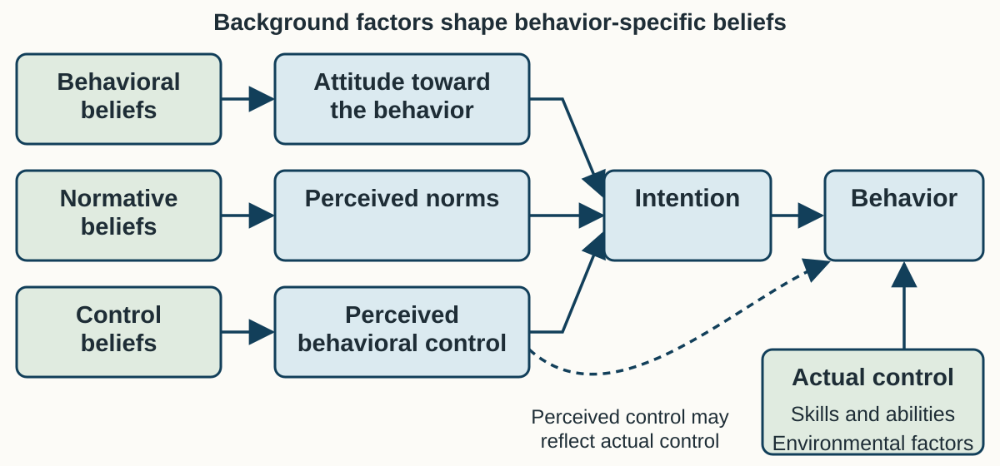
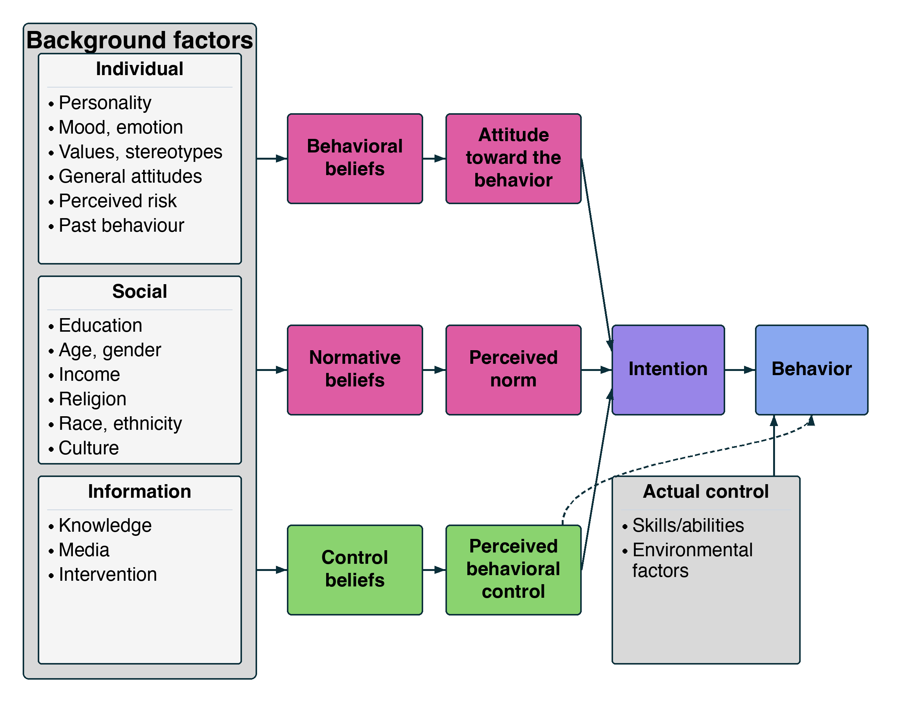
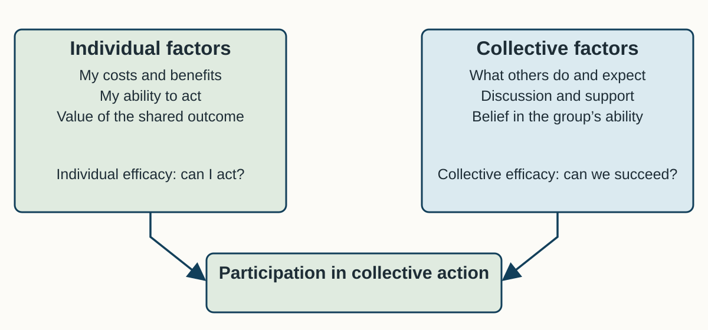
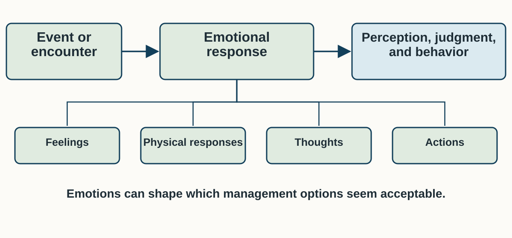
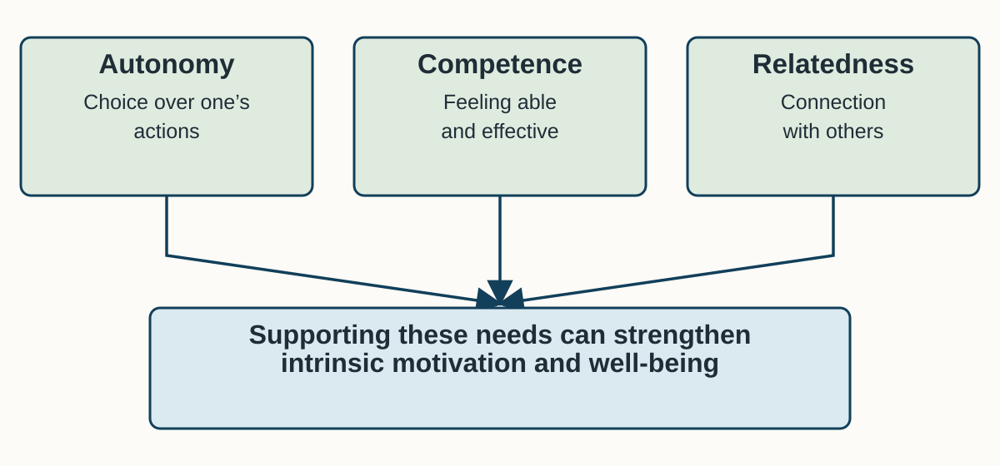
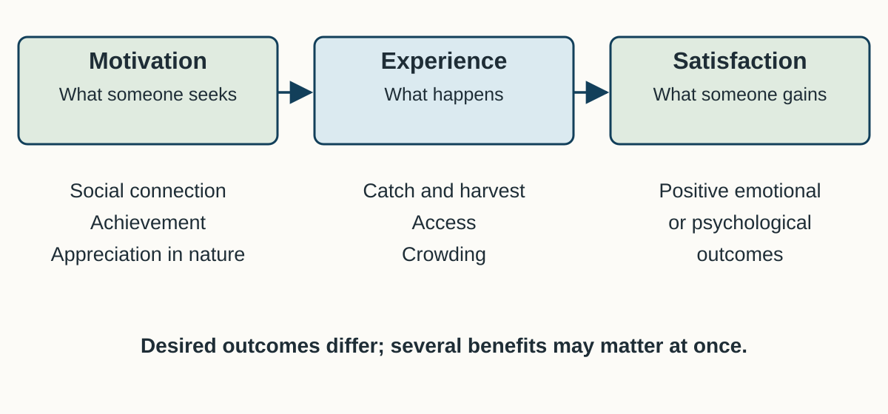
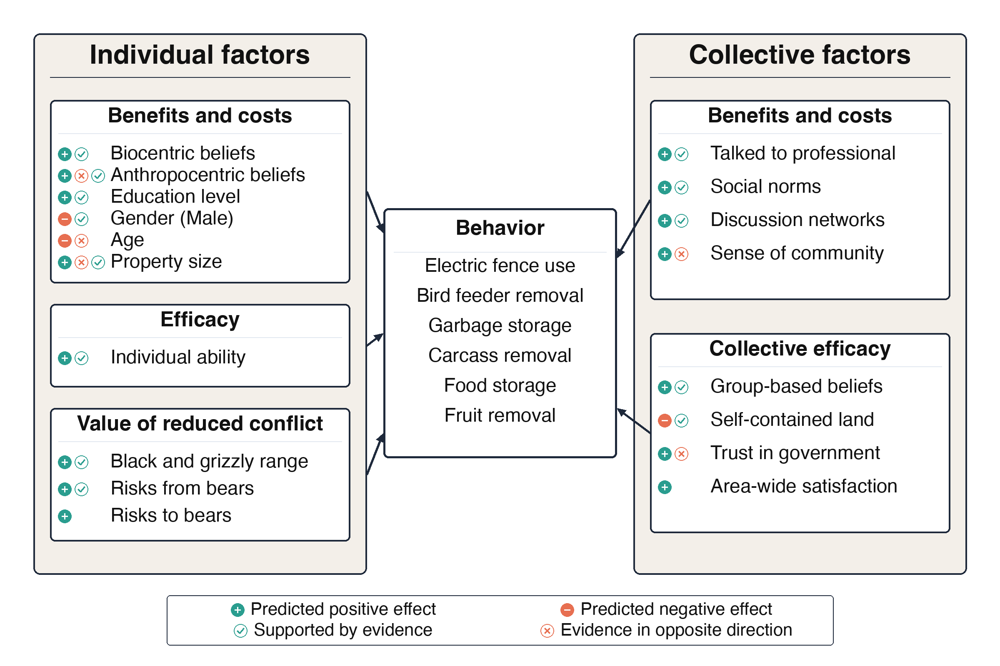

## Why might someone care but still not act?

On Monday, we separated three parts of mental life:

- Cognition: what a person thinks or believes.
- Conation: the person's motivation and intention to act.
- Affect: what a person feels.

<br>

Today we connect these to **specific actions** and to the conditions that make
those actions easier or harder.

::: notes
Time: 1 minute. Source: Chapter 8, §§8.3–8.4. Ask students to recall the person
and the situation. A concern about wildlife does not tell us what someone
intends to do, whether others support it, or whether the action is possible.
This is a 50-minute core lesson. The final four slides are optional reference
material, with no additional time allocated. Keep the four-minute pair activity.
:::

## What you should be able to explain

By the end of class, you should be able to:

<br>

- specify an observable behavior using TACT;
- explain how beliefs, norms, and control shape intention and action;
- explain why cooperation depends on both individuals and their social setting;
- distinguish emotions, motivations, and satisfaction; and
- choose a response and a measure that fit the behavior you want to change.

::: notes
Time: 1 minute. Source: Chapter 8, §§8.4–8.5. These objectives extend Monday's
foundations and support this Friday's four response items. Introduce motivation and
satisfaction as useful beyond this Friday's boating case, including recreation and
stewardship. Do not make every framework answer the same question.
:::

## What a framework helps us see

{fig-alt="The cognitive hierarchy moves from relatively stable values and value orientations to more specific attitudes and norms, intentions, and behavior. Greater specificity makes the cognitions more sensitive to the situation." height=340px}

Monday's hierarchy connected broad values to specific decisions. Today's
frameworks explain **different parts of that connection**.

::: notes
Time: 1 minute. Source: Chapter 8, §8.4.1, Figure 8.1, and Box 8.5. Briefly
trace values, value orientations, attitudes and norms, intentions, and behavior.
Reasoned action develops the intention/action part; collective action includes
participation by others; affect and motivation ask about feelings and desired
outcomes. These are complementary approaches, not interchangeable labels.
The figure's labels and this spoken description provide a text equivalent.
:::

## Define the behavior first {.section-slide background-color="#2f6b57"}

What, exactly, do we want a person to do?

<br>

A broad concern about conservation is not yet an action we can observe.

::: notes
Time: 1 minute. Source: Chapter 8, §8.4.3 and Box 8.5. Before asking why someone
acts, specify the action. Introduce the next slide as a preview of this Friday's
teaching case. TACT also keeps survey questions about attitudes and intentions
at the same level of specificity as the behavior.
:::

## Start with the boating problem

In **this Friday's Thornapple Lake teaching case (October 9)**, the agency wants to limit the
spread of invasive mussels to other waters.

<br>

One action it can target is draining boats before they leave the lake.

<br>

::: {.key-idea}
“Boaters should care more” leaves us guessing about what they should do.
:::

::: notes
Time: 1 minute. Source: Chapter 8, §8.4.3; Friday Case Brief 07, §§1–2.
Thornapple Lake is a composite teaching case, not a Chapter 8 study. Students
need only this setting to follow the examples. Draining is one candidate
behavior in the brief; do not treat it as the whole decontamination program.
Ask what a ramp observer could actually see.
:::

## TACT: make the behavior observable

Specify the draining behavior with four questions:

```{r}
#| label: tact-behavior-table
#| echo: false
#| output: asis

source("../table-style.R")

data.frame(
    Letter = c("Target", "Action", "Context", "Time"),
    Question = c("What or whom?", "Do what, exactly?",
                 "Where, under what conditions?", "When, how often, for how long?"),
    Weak = c("the environment", "be responsible", "in general", "someday"),
    Strong = c("live wells, bilge, and drain plug", "drain water; pull the plug",
               "before leaving Thornapple's north ramp",
               "every trip, 2027 open-water season"),
    check.names = FALSE
) |>
    nres315_slide_table(font_size = 22, header_font_size = 24, row_padding = 10)
```

<br>

A ramp observer could record whether this action happened.

::: notes
Time: 3 minutes. Source: Chapter 8, §8.4.3 and Box 8.5; Friday Case Brief 07,
Exhibit A. Assemble the statement: boaters pull the drain plug and drain live
wells and bilge before leaving Thornapple's north ramp, every trip during the
2027 open-water season. This specifies candidate 3 for one ramp. Ask the class
to name what a technician would record. The assigned EPUB's §8.4.3 points to
Box 8.4 for TACT; the specificity discussion is actually in Box 8.5.
:::

## The reasoned action approach

{fig-alt="Behavioral beliefs shape attitudes toward the behavior; normative beliefs shape perceived norms; control beliefs shape perceived behavioral control. All three shape intention, which predicts behavior. Actual skills and environmental conditions also influence behavior." height=490px .fill-content}

::: notes
Time: 3 minutes. Source: Chapter 8, §8.4.3 and Figure 8.2. Read the three paths
from left to right. Attitude is an evaluation of doing the behavior; norms
concern perceived social expectations; control concerns belief in one's ability
to carry it out. Intention means readiness to act. Distinguish this from actual
control: skills, abilities, and environmental conditions. The diagram is a
simplified teaching adaptation of Figure 8.2, not a fitted statistical model.
Explain the dashed connection from perceived control to behavior as a possible
reflection of actual control, not proof that confidence removes a physical
barrier. Describe the arrows aloud; color is not needed to follow the paths.
:::

## Where those beliefs come from

{fig-alt="Chapter 8 Figure 8.2: individual, social, and information background factors feed behavioral, normative, and control beliefs. These feed attitudes, perceived norms, and perceived control, then intention and behavior. Actual control also influences behavior; perceived control has a dashed connection to behavior." height=490px}

::: notes
Time: 1 minute. Source: Chapter 8, §8.4.3 and Figure 8.2. This is the complete
manuscript figure. Point to individual background factors (values, emotion,
perceived risk, past behavior), social background factors (education and
culture), and information (knowledge, media, interventions). They help explain
where behavior-specific beliefs come from. A mailer is one source of
information, not a direct shortcut from knowledge to behavior. Describe each
column and the actual-control box aloud. The prior slide gives a larger, simpler
view of the main paths; use this slide for the full model rather than asking
students to copy every background variable.
:::

## Ask about the action, not just the problem

In the Thornapple survey, these are different questions:

```{r}
#| label: behavior-specific-beliefs
#| echo: false
#| output: asis

data.frame(
    Question = c("Would mussels harm this lake?",
                 "Does draining my boat make a difference?",
                 "Do people I respect expect me to drain it?",
                 "Can I drain it without making my group wait?"),
    `What it helps us understand` = c("General concern about the problem",
                                    "A belief about the benefit of draining",
                                    "Perceived social expectations",
                                    "Perceived ability under these conditions"),
    check.names = FALSE
) |>
    nres315_slide_table(font_size = 24, header_font_size = 24, row_padding = 10)
```

<br>

Agreeing that mussels are harmful does not answer the other three.

::: notes
Time: 2 minutes. Source: Chapter 8, §8.4.3 and Box 8.5; Friday Case Brief 07,
Exhibit B. General concern and evaluation of a specified behavior are not the
same construct. For local anglers, 94% agree mussels would harm the lake, but
38% agree draining makes a difference. These are percentages agreeing with two
survey statements, not two observed behavior rates. Do not conclude that
attitudes toward draining are favorable from the general concern item alone.
:::

## What people do and what people expect

Two kinds of social norms can influence the same behavior:

::: {.columns}
:::: {.column width="50%"}
### Descriptive norms

What others typically do.

<br>

“Most other boaters at this ramp drain their boats.”
::::
:::: {.column width="50%"}
### Injunctive norms

What others approve of or expect.

<br>

“People I respect expect me to drain my boat.”
::::
:::

<br>

A **personal norm** is one's own sense of moral duty.

::: notes
Time: 2 minutes. Source: Chapter 8, §8.3 and Box 8.1; Friday Case Brief 07,
Exhibit B. Social norms are group expectations; personal norms are felt moral
obligations. Explain that someone can believe a group approves of draining
while also believing few members do it. The survey records the respondent's
perceptions. It does not establish what the group actually does or expects.
Use the two column headings as spoken labels, not color cues.
:::

## Intending to act is not the same as being able to

Among local boat anglers in this Friday's case:

- 72% intend to drain before leaving on every trip next season.
- 29% believe they could drain without making their group wait.
- The north ramp has an 18-minute peak wait and no designated drain area.

<br>

::: {.key-idea}
Perceived control is a belief. Actual control also depends on skills and conditions.
:::

::: notes
Time: 2 minutes. Source: Chapter 8, Figure 8.2; Friday Case Brief 07, Exhibits
B–C. Intention is the most immediate predictor in the model, but a statement
of intention is not observed behavior. The ramp audit identifies conditions
that could obstruct action. These separate survey percentages cannot establish
an individual-level intention–behavior gap, and actual draining was not counted.
Treat them as a reason to investigate constraints, not proof of causation.
:::

## Choose a response that fits the evidence

If boaters doubt that draining helps, address that belief about the action.

<br>

If they think their group does not expect it, work with people whose approval
matters to them.

<br>

If they do not know how to drain, teach the steps. If space or waiting time is
the obstacle, change those conditions.

::: notes
Time: 2 minutes. Source: Chapter 8, §8.4.3 and Figure 8.2; Friday Case Brief 07,
Exhibits B–C and §7. Ask which survey item or audit observation supports each
response. More than one influence can matter. Training and a physical ramp
change address different kinds of control. Avoid the unsupported claim that
unfavorable attitudes are rare in conservation. The next framework asks what
happens when benefits depend on many people participating.
:::

## Collective action {.section-slide background-color="#123f5a"}

Some conservation benefits depend on many people contributing.

<br>

What makes someone willing to do their part?

::: notes
Time: 1 minute. Source: Chapter 8, §8.4.2. Collective action means individuals
or groups working toward a shared goal. Move from a person's intention to
participation by a group. The framework is useful when conservation problems
cross property lines or depend on coordinated behavior.
:::

## Why cooperation can be difficult

A **social dilemma** arises when actions that seem beneficial to each person
produce a worse outcome for the group.

<br>

The chapter's example: one household planting native vegetation may have a
limited habitat effect; many participating households can provide greater benefits.

<br>

People weigh their costs, the shared benefit, and whether others will contribute.
Someone may benefit while leaving the work to others: **free-riding**.

Incentives and group size can also affect participation.

::: notes
Time: 2 minutes. Source: Chapter 8, §8.4.2 and §8.8. Introduce incentives and
group size as additional influences on cooperation. Public goods are difficult
to exclude people from and are not depleted by use; common-pool resources are
also difficult to exclude people from, but use can diminish them. These are
resource/benefit properties, not synonyms for collective action. Coordination
can involve formal organizations, discussion networks, social identity, and
belief that the group can succeed. Do not call nonparticipation irrational;
people act on perceived costs and benefits.
:::

## Shared benefits and shared resources

::: {.columns}
:::: {.column width="50%"}
### Public goods

It is difficult to exclude people from benefiting.

<br>

One person's use does not reduce what is available to others.
::::
:::: {.column width="50%"}
### Common-pool resources

It is difficult to exclude people from using the resource.

<br>

Use can reduce what remains for others.
::::
:::

<br>

Both can require people to coordinate their actions.

::: notes
Time: 1 minute. Source: Chapter 8, §8.4.2 and §8.8. Explain the shared
exclusion problem and the difference in depletion. Do not confuse the resource
properties with ownership or call all publicly owned wildlife a public good.
The collective action framework asks how people coordinate around these
shared benefits and resources. These definitions also help with later
sociology and economics material.
:::

## Individual and collective influences

{fig-alt="The collective interest model links individual costs and benefits, ability to act, and value of the shared outcome with collective factors including others' actions and expectations, discussion and professional support, and belief in the group's ability. Both sets of factors influence participation." height=490px .fill-content}

::: notes
Time: 2 minutes. Source: Chapter 8, §8.4.2 and Box 8.4, Figure 1. The diagram
summarizes the collective interest model used in the Montana study; it is not
a new estimate of the strength of these relationships. Individual efficacy
concerns one's own ability; collective efficacy concerns the group's ability.
Read both panels and their arrows aloud. Costs, benefits, networks, and norms
can matter together. The complete manuscript figure is in the reference slides.
:::

## What the Montana bear study found

Researchers studied several ways landowners secure bear attractants, including
garbage storage, bird feeder removal, and electric fencing.

<br>

- Different actions were associated with different individual factors.
- Collective factors mattered across the actions studied.
- Landowners who believed neighbors secured attractants, and expected them to
  continue, were **30%–100% more likely** to secure their own.

::: notes
Time: 2 minutes. Source: Chapter 8, Box 8.4 and its Figure 1. The study used a
landowner survey and questionnaire; these are associations, not a randomized
intervention effect. Biocentric beliefs were the most consistent individual
predictor. Practitioners adjusted communication to describe normative behavior,
reduce isolation, and encourage conversations with wildlife professionals.
Do not turn 30%–100% into percentage points or a predicted effect at Thornapple.
:::

## A perceived norm is not a behavior count

In this Friday's survey, 22% of local anglers agreed:

> “Most other boaters at this ramp drain their boats.”

<br>

That is the share agreeing with a statement about others. It does **not** mean
22% of boats were observed draining.

<br>

Before claiming what most people do, collect evidence of what they actually do.

::: notes
Time: 2 minutes. Source: Chapter 8, §8.3 and §8.4.2; Friday Case Brief 07,
Exhibit B and §6. The tournament/out-of-state figure is 19%; small-craft is 27%.
All measure perceived descriptive norms. The brief says actual compliance is
unknown. Normative messages should use verified information. Low perceived
participation could discourage cooperation, but the survey alone does not show
that the perception is mistaken. This corrects the prior blanket assertion
that people routinely underestimate compliance in this case.
:::

## Affect: emotions and behavior

{fig-alt="An event or encounter can evoke an emotional response involving feelings, physical responses, thoughts, and actions. Emotions influence perception, judgment, and behavior, including the acceptability of management options." height=490px .fill-content}

::: notes
Time: 2 minutes. Source: Chapter 8, §8.4.4. This is a teaching summary of the
section, not a separate causal model or a substitute for the reasoned action
approach. Emotions are psychological and physiological responses, not simply
positive or negative attitudes. The same robin at a feeder or raccoon at a
trash can can evoke appreciation, awe, fear, or disgust. Describe all four
components aloud; reactions vary with experience and social/cultural context.
:::

## Ask about the feeling and what brought it on

The chapter describes measuring responses to a particular stimulus with tools
such as the **Discrete Emotions Questionnaire**.

<br>

A deer-management study found that emotions influenced which management options
people considered acceptable.

<br>

In this Friday's case, “I feel blamed” and “I feel worried about losing this fishery”
ask about different emotional responses.

::: notes
Time: 1 minute. Source: Chapter 8, §8.4.4; Friday Case Brief 07, Exhibit B.
Measure the emotion and its context rather than labeling someone emotional.
An evaluation of draining and resentment toward an agency answer different
questions. The deer example establishes management relevance; do not invent
which option a particular emotion favored. The case survey does not establish
that a new harm message would cause additional blame, but it makes that risk
worth considering.
:::

## People can want different things from the same activity

The **multiple satisfaction approach** recognizes several benefits of hunting,
fishing, and other wildlife activities:

<br>

- Affiliative: spending time with others and building relationships.
- Achievement: reaching a goal or testing one's skill.
- Appreciative: enjoying nature, peace, or a sense of belonging.

<br>

A person may seek more than one benefit. Managing an experience requires more
than setting a bag limit.

::: notes
Time: 2 minutes. Source: Chapter 8, §8.4.5. Explain the three orientations from
Decker and Connelly. They describe motivations, not three fixed kinds of people.
For anglers, distinguish harvest (keeping fish), quantity (number caught), and
quality (challenge or a trophy experience). Ask which of these would be visible
in a catch total and which would require asking about the experience.
:::

## Desired experiences can help us understand different publics

The **recreation experience preference approach** measures the psychological
outcomes people seek and considers how those preferences occur together.

<br>

**Specialization** describes a continuum from novice to expert, reflected in
equipment, skill, knowledge, and commitment.

<br>

These approaches help identify shared goals and possible conflicts among users.

::: notes
Time: 2 minutes. Source: Chapter 8, §8.4.5. The REP scale can identify segments
with different combinations of desired outcomes. Specialization is more than
skill alone, and the chapter does not say all experts want the same experience.
Use this to explain why a single recreation offer may serve users differently.
Do not infer a boater's specialization solely from boat type or tournament
membership. Preferences need evidence, just as attitudes and norms do.
:::

## Self-determination theory

{fig-alt="Self-determination theory identifies autonomy, or choice over one's actions; competence, or feeling able and effective; and relatedness, or connection with others. Supporting these needs can strengthen intrinsic motivation and well-being." height=490px .fill-content}

::: notes
Time: 2 minutes. Source: Chapter 8, §8.4.5. Read the needs and connection aloud.
Intrinsic motivation concerns engaging because the activity itself is valued
or satisfying. The chapter says supporting these needs often strengthens
intrinsic motivation and wellness; it does not promise automatic compliance.
Ask how a conservation activity could offer meaningful choice, build capability,
and connect participants. In this Friday's case, consider how delivery might affect
these needs without assuming all requirements undermine autonomy.
:::

## Motivation, experience, and satisfaction

{fig-alt="Motivation concerns the outcomes someone seeks before participating. The experience includes what happens during participation. Satisfaction concerns the positive emotional or psychological outcomes of that experience. Desired benefits differ across people, and several can matter at once." height=490px .fill-content}

::: notes
Time: 1 minute. Source: Chapter 8, §8.4.5. This is a conceptual summary, not a
fitted causal model. The chapter defines satisfaction as a positive emotional
or psychological result of an experience. A preference survey and a satisfaction
survey therefore answer different questions. Do not infer satisfaction from
participation alone. Describe the diagram in order.
:::

## What the satisfaction studies tell us

The chapter reports two findings:

- For anglers, catch rate, fish size, and harvest were the largest and most
  consistent determinants of satisfaction. Access and crowding were the
  strongest non-catch factors.
- For turkey hunters, achievement sometimes mattered more than appreciation
  or affiliation. Appreciation became relatively more important when hunters
  were unsuccessful.

<br>

Several benefits matter, but they do not always matter equally.

::: notes
Time: 2 minutes. Source: Chapter 8, §8.4.5. Attribute the angler finding to the
Birdsong et al. meta-analysis and the turkey finding to Schroeder et al., as
reported in the chapter. The multiple satisfaction approach does not establish
that harvest is unimportant. Desired outcomes and actual outcomes should both
inform management. No external numerical effect sizes or universal rankings
are implied by this slide.
:::

## Choose the framework for the question

```{r}
#| label: framework-questions
#| echo: false
#| output: asis

data.frame(
    Approach = c("Cognitive hierarchy", "Reasoned action", "Collective action",
                 "Affective approach", "Motivation and satisfaction"),
    Question = c("How do broad values connect to a specific decision?",
                 "What shapes intention, and what allows action?",
                 "Why contribute to an outcome shared with others?",
                 "How do feelings shape a response or acceptance?",
                 "What does someone seek, and what do they gain?"),
    check.names = FALSE
) |>
    nres315_slide_table(font_size = 23, header_font_size = 25, row_padding = 9)
```

<br>

A single conservation problem may need more than one approach.

::: notes
Time: 1 minute. Source: Chapter 8, §§8.4–8.5. The chapter presents a collection
of frameworks and approaches, not one theory that subsumes all the others.
Self-determination theory asks specifically about needs supporting motivation.
Return to the opening distinction among cognition, conation, and affect.
:::

## With a partner: explain the evidence

Use these comments from this Friday's teaching case:

> “There's a line of eight boats and a guy in a hurry behind me. I'm not holding
> that up for ten minutes.”

> “On the tournament circuit everybody decons. You'd get talked about if you didn't.”

> “Every sign out here is written like we did something wrong.”

For each, name the concept, explain what the comment suggests, and propose a
response. What would you still need to know?

::: notes
Time: 4 minutes. Source: Chapter 8, §§8.4.2–8.4.5; Friday Case Brief 07,
Exhibit D. Allow two minutes of discussion, then two for comparison. The first
suggests perceived control and a situational time/space barrier. The second
suggests descriptive and injunctive norms. The third suggests affect; an SDT
interpretation is possible but needs further evidence about needs. A comment
is useful evidence, not an estimate of how many people experience a problem.
Ask for the additional survey or observation that would test each explanation.
:::

## Measure the behavior you want to change

For draining, count whether boats perform the specified action before leaving.

<br>

A count of brochure pickups measures distribution. A reported intention measures
readiness. Neither establishes that boats were drained.

<br>

Decide what result would lead you to change your response.

::: notes
Time: 1 minute. Source: Chapter 8, §8.4.3 and Box 8.5; Friday Case Brief 07,
§6. Keep the measure matched to target, action, context, and time. Record when
and where observations occur so the result can be interpreted. A revision
trigger is a decision rule for the proposed teaching-case strategy, not a
result already observed. Do not invent a universal target compliance rate.
:::

## Preparing for this Friday, October 9

For **this Friday, October 9**, read the **Thornapple Lake Decontamination
Problem** case brief before class.

<br>

Bring Chapter 8's concepts. The brief supplies the scenario, survey, ramp audit,
comments, strategies, costs, and monitoring options.

<br>

Your group will define the action, explain the evidence, and recommend a
response within **$220,000**.

::: notes
Time: 1 minute. Source: Chapter 8, §§8.4–8.5; Friday Case Brief 07, §§6–8.
Use the assigned target behavior, person factors, and situation/norms roles.
Show the budget arithmetic and acknowledge unknowns. The earlier campaign
produced no observed change, but draining was not counted; avoid claiming a
measured zero effect or that 92% concern proves the reason it failed.
:::

## What would you change, and why?

Name the behavior, the evidence supporting your explanation, and the response
that follows from it.

<br>

Then say what you would observe to find out whether the response helped.

::: notes
Time: 1 minute. Source: Chapter 8, §8.5. Ask for one short explanation using
this sequence. Next module extends the discussion to groups, institutions,
identity, and place. End the core lesson here. The following slides provide
additional chapter examples for questions or review; they have no allocated
core teaching time.
:::

## Reference: the full Montana model

{fig-alt="The complete collective interest model from the manuscript shows individual benefits and costs, efficacy, and value of reduced conflict; collective benefits and costs and collective efficacy; and six attractant-securing behaviors. Plus and minus symbols show predicted directions, while check marks and crosses show whether evidence supported or contradicted predictions." height=470px}

::: notes
Time: 0 minutes. Source: Chapter 8, Box 8.4, Figure 1; manuscript figure-caption
file, Figure 8.3. Optional reference. The EPUB labels this as the box's Figure 1;
the separate source asset/caption labels it Figure 8.3. These are the same
model. Explain the textual legend: a sign is a prediction, a check or cross
reports whether evidence supported it. Read the individual and collective
panels and six behaviors aloud. Do not describe every predicted relationship
as supported. The simplified core diagram omits these result symbols.
:::

## Reference: four branches of psychology

- Cognitive psychology studies perception, reasoning, and decision-making.
- Social psychology studies how people and their social setting influence one another.
- Environmental psychology studies relationships between people and their surroundings.
- Conservation psychology applies psychological knowledge to healthy relationships
  between people and nature.

<br>

**Dual-process theory** distinguishes fast, intuitive processing (System 1)
from slower, deliberate processing (System 2).

::: notes
Time: 0 minutes. Source: Chapter 8, Box 8.1. Optional reference for the chapter's
subdiscipline guiding question. Dual-process theory and cognitive bias belong
to the cognitive psychology discussion; they are not the two components of
reasoned action. The box describes an automatic negative response to large
mammals and a coexistence campaign encouraging deliberation. Avoid treating
fast thinking as always wrong or slow thinking as always correct.
:::

## Reference: coexistence and disagreement

**Tolerance** means being willing to endure a species' presence. **Acceptance**
includes recognizing its value and actively supporting its presence or conservation.

<br>

In the Maine bear-hunting case, groups disagreed about whether baiting,
hounding, and trapping were unethical or necessary for population management.

<br>

Those arguments involved beliefs and values as well as evaluations of particular practices.

::: notes
Time: 0 minutes. Source: Chapter 8, §8.3 and Box 8.3. Optional reference connecting
Monday's cognitive hierarchy to a manuscript case. The media content analysis
examined arguments, not a representative public-opinion survey. The chapter
calls for respect, trust, and an inclusive decision process. Do not infer that
all tolerance is acceptance, or that more biological information alone resolves
a values disagreement. Use the chapter's historical case rather than asserting
current Maine hunting law.
:::

## Reference: support for salmon conservation was not enough

In the Downeast Maine aquaculture case, surveyed residents held positive
attitudes toward salmon conservation and the proposed program.

<br>

The program later stalled amid inadequate agency communication and community
engagement, and information from opponents.

::: notes
Time: 0 minutes. Source: Chapter 8, Box 8.2 and §8.2.1. Optional reference.
The chapter describes conservation aquaculture using marine net pens and a
partnership including the Penobscot Nation and management agencies. Early
positive attitudes did not guarantee continuing community support. Cultural
relevance requires attention to the community's values and experiences; a
framework developed in one setting must not be assumed to apply identically
everywhere. Use the assigned EPUB's complete text: the separate legacy box
DOCX contains deleted/revised text that does not extract cleanly.
:::
